# ビジネスコミュニケーション上達の手引き

**〜上級者へのステップアップガイド〜**

---

## 目次

- [第1章：ビジネスコミュニケーションの基本原則](#第1章ビジネスコミュニケーションの基本原則)
- [第2章：聞き手に合わせた情報提供の技術](#第2章聞き手に合わせた情報提供の技術)
- [第3章：簡潔に伝える技術](#第3章簡潔に伝える技術)
- [第4章：フィードバックを正しく理解する](#第4章フィードバックを正しく理解する)
- [第5章：役員・上層部とのコミュニケーション戦略](#第5章役員上層部とのコミュニケーション戦略)
- [第6章：文書作成の実践テクニック](#第6章文書作成の実践テクニック)
- [第7章：日常的なコミュニケーション改善レッスン](#第7章日常的なコミュニケーション改善レッスン)
- [第8章：実践チェックリストとテンプレート集](#第8章実践チェックリストとテンプレート集)
- [付録：シチュエーション別実践ガイド](#付録シチュエーション別実践ガイド)

---

## 第1章：ビジネスコミュニケーションの基本原則

### 1-1 効果的なコミュニケーションとは何か

ビジネスにおける効果的なコミュニケーションとは、**「情報の正確な伝達」と「目的の達成」を同時に実現すること**です。この二つのバランスを常に意識することが、コミュニケーション上達の第一歩となります。

効果的なコミュニケーションの3要素：

1. **目的の明確化**：なぜこの情報を伝えるのか
2. **相手の理解度の把握**：相手は何を知っていて、何を知らないのか
3. **最適な情報量の選択**：必要十分な情報を選ぶ

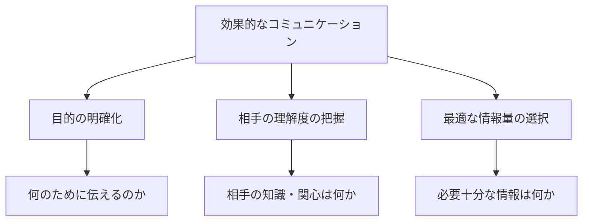

**日常レッスン**：今日の会話やメールを送る前に、「このコミュニケーションの目的は何か」を5秒考える習慣をつけましょう。

### 1-2 相手の立場を考える重要性

ビジネスコミュニケーションでは、**相手の立場、役割、関心事を理解すること**が極めて重要です。特に上司や役員とのコミュニケーションでは、彼らが持つ視点や優先事項を考慮する必要があります。

相手の立場別の関心事：

| 相手 | 主な関心事 | コミュニケーションの焦点 |
|------|------------|--------------------------|
| 経営層 | ビジネスインパクト、費用対効果 | 結果、数字、ビジネス価値 |
| 部門長 | 部門目標、リソース配分 | 進捗、リスク、必要な決断 |
| 同僚 | 協働、相互依存 | 具体的な協力内容、タイミング |
| 部下 | 期待、評価基準 | 明確な指示、フィードバック |

**日常レッスン**：次に重要な会議や報告の前に、「この相手にとって最も重要な情報は何か」をメモに書き出してみましょう。

### 1-3 コミュニケーションの目的を明確にする

コミュニケーションの目的は多岐にわたりますが、自分が何を達成したいのかを事前に明確にすることで、伝え方が変わります。主な目的には次のようなものがあります：

- **情報共有** - チームが同じ情報を持つようにする
- **意思決定の促進** - 判断に必要な情報を提供する
- **行動の促進** - 相手に特定の行動を取ってもらう
- **関係構築** - 信頼や協力関係を築く

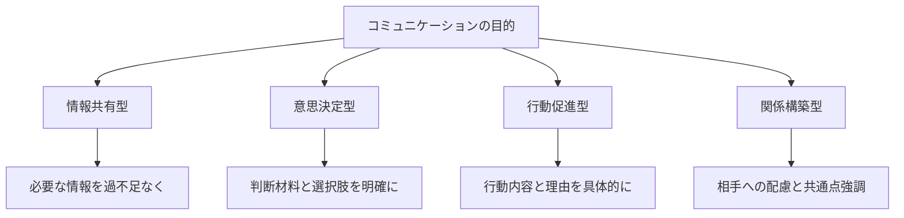

**目的別のアプローチ方法**：

1. **意思決定を求める場合**
   - 結論と必要な判断を最初に提示
   - 判断材料となる情報を簡潔に説明
   - 選択肢とその影響を明示

2. **行動を促す場合**
   - 必要な行動を具体的に伝える
   - その理由や重要性を説明
   - 期限や条件を明確にする

**日常レッスン**：コミュニケーションを始める前に「私はこの会話で何を達成したいのか」を一言で言えるようにしましょう。

### 1-4 情報の取捨選択の基準

情報過多は現代のビジネスにおける大きな課題です。相手に必要な情報だけを選択して伝えることは、効果的なコミュニケーションの核心です。

**情報選択の4つの基準**：

1. **目的関連性** - この情報は目的達成に直接関係しているか
2. **重要度** - この情報がないと理解や判断に影響するか
3. **新規性** - 相手がまだ知らない情報か
4. **アクション可能性** - この情報を基に何らかの行動が可能か

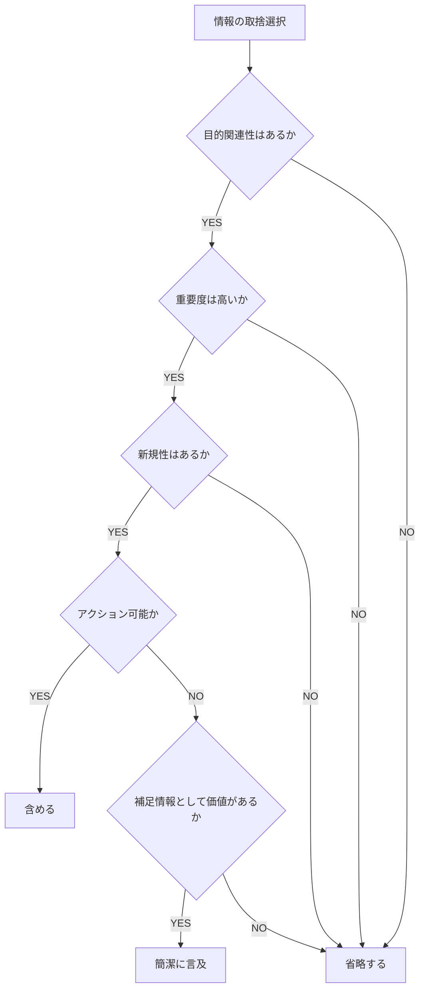

**日常レッスン**：次回の報告やメールを書く前に、伝えようとしている各情報が上記4基準に合致するかをチェックしてみましょう。

### コラム：「なぜビジネスでは簡潔さが重視されるのか」

---

**なぜビジネスでは簡潔さが重視されるのか**

ビジネスの現場で「簡潔に話してください」と言われたことはありませんか？これは単なる好みの問題ではなく、ビジネス環境の本質に根ざした要請なのです。

**時間の経済性**
ビジネスでは、時間はまさに「お金」です。経営層が1時間の会議に参加するコストは、その給与だけでなく、その時間に生み出せたはずの価値も含まれます。10人で行う1時間の会議は、合計10時間もの労働時間を消費します。だからこそ、無駄な情報で時間を浪費することは避けなければなりません。

**意思決定の効率**
人間の脳は、一度に処理できる情報量に限界があります。情報が多すぎると、かえって重要なポイントが埋もれてしまい、適切な判断ができなくなります。経営判断は、本質的な情報に基づいて行われるべきなのです。

**ある役員の言葉**
あるIT企業の役員はこう言いました。「毎日100件以上のメールと20件以上の報告書に目を通しています。一つひとつに時間をかけられません。最初の30秒で価値を見いだせないものは、残念ながら後回しにせざるを得ないのです」

**簡潔さは思いやり**
簡潔に伝えることは、相手の時間と認知資源を尊重する行為です。必要な情報を短時間で理解できるようにすることは、相手への最大の思いやりとも言えるでしょう。

次に長い説明をしたくなったら、「この情報は相手の貴重な時間を使う価値があるか」と自問してみてください。

---

## 第2章：聞き手に合わせた情報提供の技術

### 2-1 相手が何を知りたいのかを見極める方法

相手が本当に知りたいことを正確に把握することは、効果的なコミュニケーションの基礎です。ところが多くの場合、質問の表面的な内容と真の意図にはズレがあります。

**質問の背後にある意図を見抜く3つのポイント**：

1. **質問の文脈を理解する**
   - なぜ今この質問をしているのか
   - 直前の議論や状況と関連しているか

2. **質問者の役割や立場を考慮する**
   - その人の責任範囲や関心事は何か
   - どのような決断や行動を求められているか

3. **質問の種類を識別する**
   - 事実確認の質問なのか
   - 分析や見解を求める質問なのか
   - 承認や許可を求める質問なのか

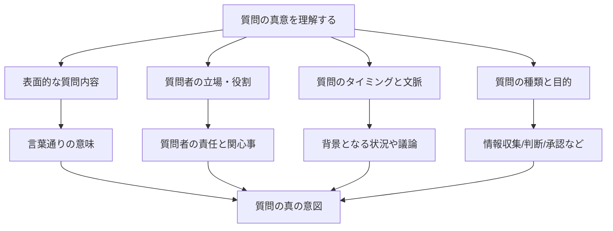

**質問の種類と適切な応答**：

| 質問の種類 | 特徴 | 適切な応答方法 |
|------------|------|----------------|
| 事実確認型 | データや状況を確認する | 正確な情報を簡潔に |
| 分析型 | 原因や影響を探る | 分析と根拠を論理的に |
| 判断求型 | 意見や提案を求める | 見解と理由を明確に |
| 承認型 | 許可や同意を得たい | 判断と条件を具体的に |

**日常レッスン**：次に質問を受けたとき、「この人はなぜこの質問をしているのか、どんな決断をしようとしているのか」を考えてから答えるようにしましょう。

### 2-2 上司・役員が求める情報の特徴

上司や役員とのコミュニケーションでは、彼らの視点や必要としている情報の特性を理解することが重要です。彼らが優先する情報には特徴があります。

**上司・役員が重視する情報の5つの特徴**：

1. **ビジネスインパクト** - 売上、コスト、顧客満足度など数値化できる影響
2. **リスクと機会** - 潜在的な問題点と可能性
3. **意思決定に必要な情報** - 判断材料となる重要事実
4. **アクションの明確さ** - 誰が何をいつまでにすべきか
5. **全体像と位置づけ** - より大きな文脈の中での意味

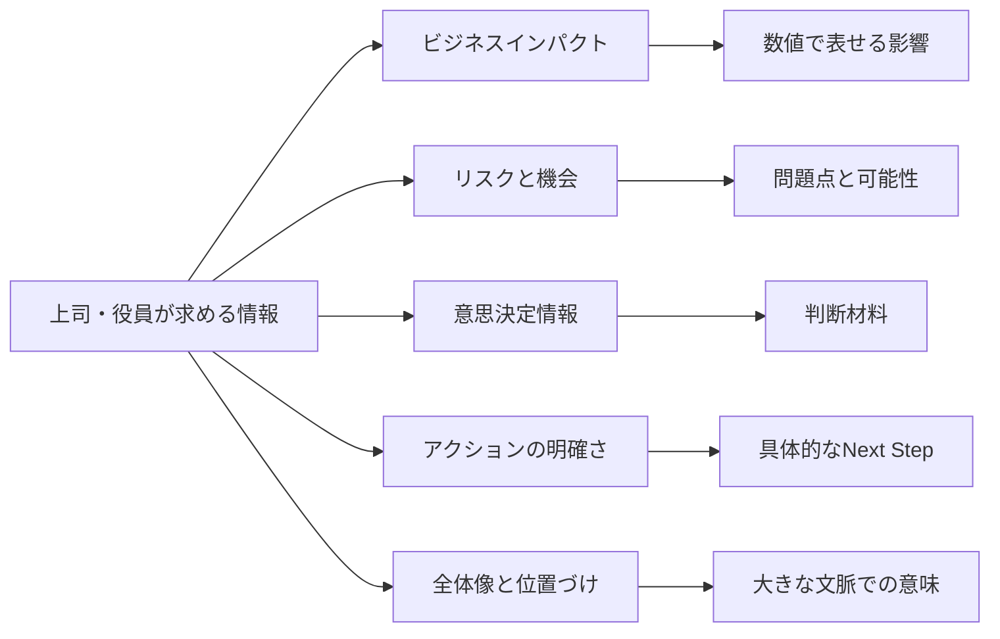

**上司の階層別の関心事**：

| 階層 | 主な関心事 | 求める情報 |
|------|------------|------------|
| 直属上司 | チーム目標達成、効率 | 進捗状況、具体的な課題、リソース |
| 部長級 | 部門目標、予算管理 | 数値指標、傾向、部門間調整 |
| 役員 | 戦略目標、株主価値 | 市場影響、競合比較、長期見通し |

**日常レッスン**：上司への次回の報告時に、上記5つの特徴を意識して情報を整理してみましょう。特に「この情報が示すビジネスインパクトは何か」を明確にしてください。

### 2-3 「知っていること」と「伝えるべきこと」の区別

私たちは自分が知っていることをすべて伝えたくなる傾向がありますが、効果的なコミュニケーションでは「知っていること」と「伝えるべきこと」を区別する必要があります。

**伝えるべき情報を選択する3つの原則**：

1. **相手の既存知識を考慮する**
   - 相手が既に知っていることは繰り返さない
   - 前提知識が欠けている場合は簡潔に補足する

2. **情報の目的適合性を評価する**
   - 目的達成に直接関係する情報を優先する
   - 興味深くても目的に無関係なら省略する

3. **情報の詳細度を調整する**
   - 重要な情報は詳しく
   - 補足的な情報は簡潔に
   - 参考情報は必要に応じて「質問があれば」と付け加える

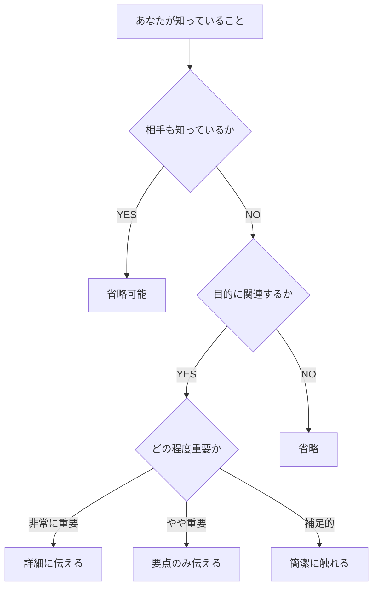

**情報の詳細度の調整例**：

プロジェクトの進捗報告の場合：
- **詳細に伝える**：予算超過の問題と理由
- **要点のみ伝える**：主要マイルストーンの達成状況
- **簡潔に触れる**：順調に進んでいる細かな作業
- **省略**：問題なく完了した過去のタスク詳細

**日常レッスン**：次回の報告準備時に、伝えようとしている各情報を「絶対必要」「あれば良い」「不要」に分類してみましょう。

### 2-4 前提知識の共有度を確認する技術

コミュニケーションの大きな障壁の一つは、「相手も自分と同じことを知っている」という誤った前提です。特に専門分野に詳しい人ほど、この「呪いの知識」に陥りやすいものです。

**前提知識の共有度を確認する方法**：

1. **事前確認法**
   - 説明を始める前に「○○についてはご存知ですか？」と確認
   - 会議前に資料を送付し、質問を募る

2. **段階的説明法**
   - 基本的な情報から段階的に詳細へ進む
   - 相手の反応を見ながら詳細度を調整する

3. **比喩活用法**
   - 専門用語を一般的な比喩で説明する
   - 「○○は△△のようなものです」と身近な例で説明

4. **フィードバック確認法**
   - 「ここまでで質問はありますか？」と途中で確認
   - 相手の表情や反応を観察する

**専門知識の説明レベル調整表**：

| 相手のレベル | 説明の特徴 | 用語の使い方 |
|--------------|------------|--------------|
| 初心者 | 基本概念の比喩説明 | 専門用語を避け、一般用語で |
| 入門者 | 基本原則と簡単な用語 | 主要用語のみ使用し説明付き |
| 中級者 | 原理原則と応用 | 一般的な専門用語は説明なし |
| 専門家 | 詳細と例外事項 | 専門用語を自由に使用 |

**日常レッスン**：次回の説明の際、「この説明に必要な前提知識は何か」をリストアップし、相手がそれを持っているか確認してから本題に入りましょう。

### ケーススタディ：「技術的説明を目的重視に変換した事例」

---

**技術的説明を目的重視に変換した事例**

**背景**：
田中さんはITシステム担当者で、新しい社内システムの導入について経営会議で説明することになりました。彼は技術的な詳細を完璧に理解していましたが、非技術系の役員に対する説明が苦手でした。

**問題点**：
最初の説明では、田中さんはシステムの技術仕様、使用言語、データベース構造などの技術的な詳細に時間を費やしました。役員たちは混乱し、「結局このシステムで何ができるのか？」という質問が出ました。

**改善プロセス**：

1. **目的の明確化**：
   田中さんは「なぜこのシステムが必要か」を考え直しました。

2. **相手の関心事の把握**：
   役員が関心を持つのは技術ではなく、ビジネス成果だと理解しました。

3. **情報の再構成**：
   技術的特徴をビジネス価値に変換しました。

**改善前の説明（技術中心）**：
「新システムはJava SpringベースでRESTful APIを実装し、PostgreSQLデータベースを使用します。OAuthによる認証システムを導入し、レスポンスタイムは現行の1/3に短縮されます...」

**改善後の説明（目的中心）**：
「新システムには3つの主要メリットがあります。
1. 顧客対応時間が40%短縮され、顧客満足度向上が期待できます
2. 月間の処理可能案件が25%増加し、売上拡大につながります
3. 運用コストが年間約1,200万円削減できます

これらは、より高速な処理エンジンと先進的なセキュリティ技術の導入によって実現します。技術的な詳細については、ご質問があればお答えします。」

**結果**：
改善後の説明では、役員たちは提案の価値をすぐに理解し、質問も「投資回収期間」や「段階的導入の可能性」など、ビジネス面に焦点が当たりました。結果として、提案は承認され、田中さんのコミュニケーション能力も評価されました。

**学び**：
技術的な話は「手段」であり、相手が知りたいのは「目的」と「効果」です。特に意思決定者には、自分の専門知識をひけらかすのではなく、その知識がもたらすビジネス価値を伝えることが重要です。

---

## 第3章：簡潔に伝える技術

### 3-1 「結論ファースト」の考え方と実践法

日本の伝統的なコミュニケーションでは、前置きや背景説明から始めて徐々に結論に至る「起承転結」型が好まれることがありますが、ビジネスコミュニケーションでは「結論ファースト」が効果的です。

**結論ファーストの3つの効果**：

1. **注目を集める**
   - 最も重要なメッセージが確実に伝わる
   - 聞き手の集中力が高いうちに核心を伝える

2. **理解の枠組みを提供する**
   - 後続の説明を整理して理解しやすくする
   - 聞き手が「何のための説明か」を理解できる

3. **時間の節約**
   - 結論だけで十分な場合は詳細説明を省略できる
   - 必要に応じて詳細の深さを調整できる

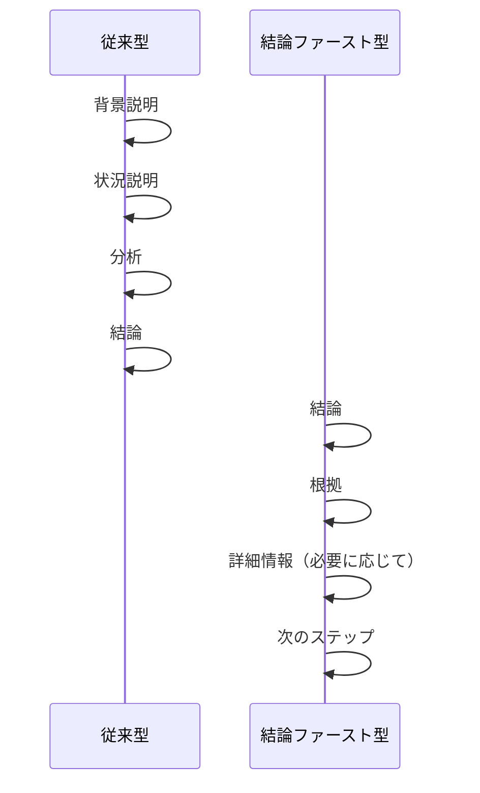

**結論ファーストの実践法**：

1. **PREP法**
   - **P**oint（結論）：最も伝えたいこと
   - **R**eason（理由）：なぜそう考えるのか
   - **E**xample（例）：具体例や証拠
   - **P**oint（結論）：再度結論を強調

2. **SDS法**
   - **S**ummary（要約）：結論や主張
   - **D**etails（詳細）：裏付けや説明
   - **S**ummary（要約）：結論の再確認

**日常レッスン**：次回のメールや報告書を書く際、最初の一文で結論を述べる練習をしましょう。「この文書で最も伝えたいことは何か」を考え、それを冒頭に置いてください。

### 3-2 不要な情報を省く訓練

ビジネスコミュニケーションでは、情報の「過多」が「不足」よりも問題となることが多いものです。不要な情報を特定し、省略する能力を高めることが重要です。

**情報を省略するための5つの判断基準**：

1. **目的関連性**
   - この情報は目的達成に直接寄与するか

2. **決定影響度**
   - この情報がなくても同じ決断ができるか

3. **詳細の適切さ**
   - この詳細レベルは相手と状況に適しているか

4. **重複性**
   - 他の場所ですでに伝えている情報ではないか

5. **時間的制約**
   - 限られた時間で優先すべき情報か

**よく省略できる情報の例**：

- 歴史的経緯（特に問題解決と無関係な場合）
- 試行錯誤のプロセス（成功したアプローチのみ伝える）
- 技術的な詳細（非専門家には不要なことが多い）
- 自明の事実（相手にとって当然知っていること）
- 個人的な感想（特に求められていない場合）

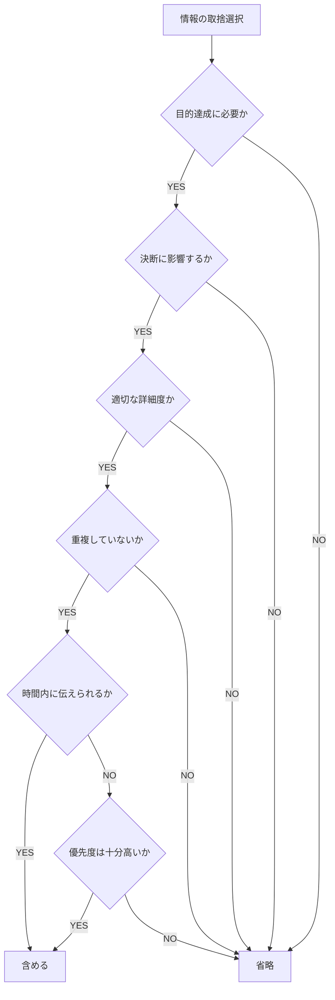

**日常レッスン**：次回のプレゼンやメールを作成したら、一度完成させた後、内容の20%を削る練習をしましょう。「これがなくても意味は伝わるか」と自問しながら削減してください。

### 3-3 長文を短くする具体的な方法

文章が長くなりがちな方には、長文を短くするための具体的な技術が役立ちます。ここでは、文章の無駄を省き、簡潔に伝えるためのテクニックを紹介します。

**文章を短くする7つの技術**：

1. **一文一義**
   - 一つの文では一つの内容だけを伝える
   - 複数の内容が含まれる文は分割する

2. **修飾語の削減**
   - 不必要な形容詞や副詞を削除する
   - 「非常に」「とても」などの強調語を減らす

3. **冗長な表現の排除**
   - 「～することができる」→「～できる」
   - 「～と考えられます」→「～と考えます」

4. **具体的な数字の活用**
   - 「多数の」→「約30%の」
   - 「長期間」→「6か月間」

5. **能動態の使用**
   - 「～されました」→「～しました」
   - 主語と行動を明確にする

6. **専門用語の適切な使用**
   - 適切な専門用語で複雑な概念を簡潔に表現
   - ただし相手が理解できる用語に限る

7. **箇条書きの活用**
   - 複数の要素を列挙する際は箇条書きにする
   - 視覚的にも把握しやすくなる

**改善例**：

改善前：
```
私たちのチームでは、先日実施した市場調査の結果について、様々な角度から詳細な分析を行い、それに基づいて現在の市場動向について検討した結果、多くの消費者が当社製品に対して非常に高い関心を示していることが明らかになり、特に20代から30代の若い世代において顕著な傾向が見られたため、今後のマーケティング戦略においては、このセグメントに対してより積極的なアプローチを検討することが可能であると考えられます。
```

改善後：
```
市場調査の結果、以下が判明しました。
・消費者の65%が当社製品に高い関心を示している
・特に20-30代での関心が最も高い（関心度78%）
このため、若年層向けマーケティングを強化すべきです。
```

**日常レッスン**：毎日のメールや報告書を書いた後、一度読み返して不要な言葉や表現を削る習慣をつけましょう。「この言葉がなくても意味は変わらないか」を常に考えてください。

### 3-4 文章の構造化テクニック

情報が多い場合でも、適切に構造化することで理解しやすく簡潔に伝えることができます。構造化によって、情報の関連性や重要度が視覚的に把握しやすくなります。

**文章構造化の5つのテクニック**：

1. **階層化**
   - 情報を主要点と補足点に分類
   - 見出しやナンバリングで階層を示す

2. **グループ化**
   - 関連する情報をまとめる
   - カテゴリー分けして提示する

3. **順序付け**
   - 時系列、重要度、論理的順序などで配列
   - 「第一に、第二に」などの順序語を使用

4. **コントラスト**
   - 類似点と相違点を明確に
   - 「一方で」「対照的に」などの表現を活用

5. **視覚的構造化**
   - 箇条書き、表、図などを活用
   - 空白や改行で視覚的な区切りを作る

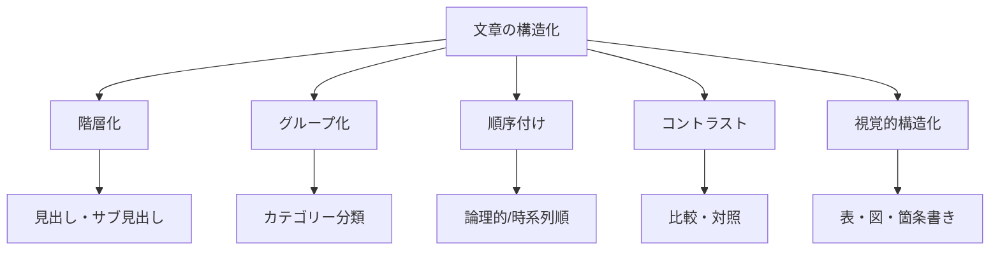

**構造化のフレームワーク例**：

1. **MECE（Mutually Exclusive, Collectively Exhaustive）**
   - 重複なく、漏れなく情報を整理する
   - 例：「内部要因/外部要因」「短期/中期/長期」

2. **4P分析（Product, Price, Place, Promotion）**
   - マーケティング要素を4つの視点で整理
   - 各Pごとに情報をグループ化

3. **5W1H（Who, What, When, Where, Why, How）**
   - 情報を6つの基本要素で整理
   - 漏れのない説明が可能になる

**日常レッスン**：次回の長めの報告書やメールを書く際に、書き始める前に情報を構造化するフレームワークを選び、アウトラインを作成してから執筆してみましょう。

### コラム：「削ることの勇気」

---

**削ることの勇気**

ある新入社員が初めての重要なプレゼンテーションを終えた後、部長からこんなフィードバックをもらいました。「資料は良くできているが、半分に削れば素晴らしいものになる」

私たちは往々にして、「情報を追加すること」に熱心で、「情報を削ること」に消極的です。なぜでしょうか？

**削れない心理の正体**

1. **「知っていることを見せたい」欲求**  
   専門知識を持っていることを示したい、自分の努力や調査の成果を認めてほしいという心理が働きます。

2. **「不足」への恐れ**  
   「情報が足りない」と思われるのを恐れるあまり、過剰に情報を詰め込みがちです。

3. **「これも必要かも」思考**  
   本当に必要な情報と「役立つかもしれない」情報の区別がつきにくくなります。

**削る勇気の価値**

フランスの作家アントワーヌ・ド・サン＝テグジュペリは言いました。「完璧とは、付け加えるものが何もないときではなく、取り去るものが何もないときに達成される」

実は、情報を削ることには大きな価値があります：

- **核心がより明確になる**：余分な情報がなければ、本当に伝えたいことが際立ちます。
- **記憶に残りやすくなる**：人間の脳は3-5の要点を覚えるのに最適です。
- **相手への敬意を示す**：相手の時間と注意力を大切にする姿勢を示します。

**削る技術を磨く**

有名な広告人デイヴィッド・オグルヴィは「自分の書いた原稿の半分を削れ」と言いました。彼が教えたのは、削ることは単なる省略ではなく、本質をより鮮明に表現する技術だということです。

次回、長い文章を書いたら、こう自問してみてください：
「もし半分の言葉で伝えなければならないとしたら、何を残すか？」

削ることを恐れず、むしろ削ることで表現力を高められると考えてみてください。それが「削る勇気」です。

---

## 第4章：フィードバックを正しく理解する

### 4-1 フィードバックの本質を読み取る

フィードバックは成長のための貴重な情報ですが、その真意を正確に理解することが重要です。表面的な言葉だけでなく、背後にある本質を読み取る能力を身につけましょう。

**フィードバックの3つの層**：

1. **表面的な言葉**
   - 実際に発せられた言葉や文章
   - 例：「この報告書はわかりにくい」

2. **具体的な問題点**
   - 言葉の背後にある具体的な課題
   - 例：「構成が論理的でない」「重要点が埋もれている」

3. **根本的な期待**
   - フィードバックを通じて示されている本質的な期待
   - 例：「簡潔で論理的な情報提供を期待している」

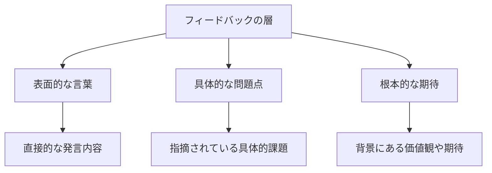

**フィードバックの種類と対応**：

| フィードバックの種類 | 特徴 | 効果的な対応 |
|----------------------|------|--------------|
| 直接的批判 | 問題点を明示的に指摘 | 感謝し、具体的な改善策を確認 |
| 遠回しな指摘 | 婉曲的で読み取りが必要 | 質問で具体化してから対応 |
| 建設的提案 | 改善方法が含まれている | 提案の意図を理解して適用 |
| 感情的反応 | 感情が前面に出ている | 冷静に本質的問題を特定 |

**フィードバックを理解するための質問例**：

- 「具体的には、どの部分が最も問題だと感じましたか？」
- 「どのような形で改善したら良いでしょうか？」
- 「最も重視すべき点は何でしょうか？」
- 「このフィードバックの主な目的は何でしょうか？」

**日常レッスン**：次回フィードバックを受けたとき、すぐに反応せず、「このフィードバックの本当の意味は何か」と自問し、必要なら質問して明確化しましょう。

### 4-2 「書き直せ」の真意を理解する

「これではわからない、書き直せ！」というフィードバックを受けたとき、多くの人は「情報が不足している」と解釈し、さらに詳しく書き加える傾向があります。しかし、実際には「情報が多すぎて整理されていない」という意味であることが少なくありません。

**「書き直せ」の多様な解釈**：

1. **情報の過多**
   - 「重要点が埋もれている」
   - 「必要のない詳細が多すぎる」

2. **構成の問題**
   - 「論理的な流れになっていない」
   - 「優先順位が明確でない」

3. **視点のずれ**
   - 「相手の関心事に合っていない」
   - 「目的に適した内容になっていない」

4. **表現の不明確さ**
   - 「抽象的で具体性に欠ける」
   - 「専門用語が多すぎる」

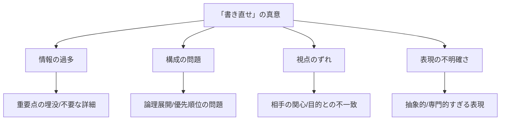

**「書き直せ」への対応ステップ**：

1. **真意の確認**
   - 「具体的にどの点が問題でしょうか？」
   - 「どのような点を改善すべきでしょうか？」

2. **改善の焦点を絞る**
   - 全面的な書き直しか、特定部分の修正か
   - 内容の問題か、表現の問題か

3. **改善の方向性を確認**
   - 「より簡潔にすべきか、詳細にすべきか」
   - 「構成を変えるべきか、内容を変えるべきか」

4. **具体例を求める**
   - 「こういう形が望ましいということでしょうか？」
   - 「過去の良い例があれば教えてください」

**日常レッスン**：次回「書き直せ」と言われたら、まず「追加と削除、どちらの方向が望ましいか」を確認する習慣をつけましょう。そして書き直す前に、改善の方向性を明確にしてください。

### 4-3 建設的な質問の仕方

フィードバックを受けたとき、その真意を理解し効果的に改善するためには、建設的な質問ができることが重要です。適切な質問は、相手の本当の期待を引き出し、効率的な改善につながります。

**建設的な質問の4つの特徴**：

1. **オープン型**
   - 「はい/いいえ」では答えられない質問
   - 相手の考えを引き出せる

2. **具体性重視**
   - 抽象的な回答ではなく具体例を引き出す
   - 実際の行動に結びつきやすい

3. **非防衛的**
   - 自己防衛や言い訳につながらない
   - 相手を責めない中立的な表現

4. **解決志向**
   - 問題の指摘ではなく解決策を探る
   - 次のステップに焦点を当てる

**効果的な質問例**：

| 状況 | 効果的な質問 | 避けるべき質問 |
|------|--------------|----------------|
| 「わかりにくい」と言われた | 「どの部分が特にわかりにくいと感じましたか？」 | 「何がわからないのですか？」 |
| 「もっと簡潔に」と言われた | 「どの情報が最も重要だと思われますか？」 | 「何を削ればいいのですか？」 |
| 「的外れ」と言われた | 「どのような点に最も焦点を当てるべきでしたか？」 | 「何が間違っていたのですか？」 |
| 「深掘りが足りない」と言われた | 「どの側面をより詳しく分析すべきでしょうか？」 | 「どこまで調べればいいのですか？」 |

**質問の組み立て方**：

1. **現状確認**
   - 「現在の〇〇について、どのような点が課題だとお考えですか？」

2. **具体例要求**
   - 「理想的な例や、過去の良い事例を教えていただけますか？」

3. **優先順位確認**
   - 「改善すべき点のうち、最も重要なものは何でしょうか？」

4. **次のステップ確認**
   - 「今後どのように進めていくのが良いとお考えですか？」

**日常レッスン**：フィードバックを受けたら、すぐに答えを出そうとせず、まず2-3の質問をして相手の期待を明確にする習慣をつけましょう。特に「具体的には？」という問いかけを意識的に使ってみてください。

### 4-4 上司の意図を確認するテクニック

上司からのフィードバックや指示の真意を正確に理解することは、効率的な業務遂行と良好な関係構築の両方に不可欠です。ここでは、上司の真の意図を確認するための効果的なテクニックを紹介します。

**上司の意図確認の5つのテクニック**：

1. **パラフレーズ（言い換え）**
   - 上司の言葉を自分の言葉で要約して確認
   - 「つまり、〇〇ということでしょうか？」

2. **具体例のリクエスト**
   - 抽象的な指示に対して具体例を求める
   - 「具体的にはどのようなイメージでしょうか？」

3. **優先順位の確認**
   - 複数の指示がある場合の優先順位を確認
   - 「これらの中で最も重視すべき点は何でしょうか？」

4. **目的の確認**
   - 指示の背後にある目的や意図を確認
   - 「このタスクの最終的な目的は何でしょうか？」

5. **制約条件の確認**
   - 時間、予算、品質などの制約を明確にする
   - 「リソースや時間の制約はありますか？」

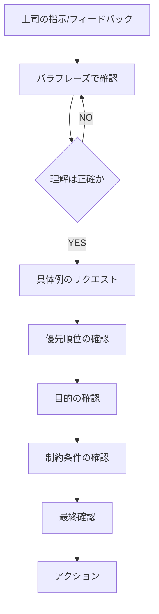

**確認のタイミングと方法**：

1. **その場での即時確認**
   - 指示を受けた直後に簡潔に確認
   - ミーティング終了時のサマリーとして確認

2. **メールでのフォローアップ**
   - 複雑な指示の場合は後でメールで確認
   - 「本日ご指示いただいた〇〇について確認です」

3. **行動前の最終確認**
   - 重要な作業に着手する前の最終確認
   - 「これから〇〇を進めますが、方向性は合っていますか」

**日常レッスン**：次回上司から重要な指示を受けたら、その場で「私の理解では〇〇ということですが、それで合っていますか？」と確認する習慣をつけましょう。また、複雑な指示の場合は、メモを取りながら聞き、後で確認メールを送ることも有効です。

### ケーススタディ：「フィードバックの誤解から学んだ教訓」

---

**フィードバックの誤解から学んだ教訓**

**背景**：
佐藤さんは入社3年目の営業部員です。大手クライアントへの新規提案書を作成し、部長に確認してもらったところ、「内容が薄い。もっと充実させて」というフィードバックを受けました。

**最初の対応**：
佐藤さんは「内容が薄い」という言葉を文字通りに解釈し、提案書のページ数を倍に増やしました。競合他社の分析、業界動向の詳細なデータ、自社製品の技術仕様など、調査した情報をすべて盛り込みました。

**結果**：
再提出した提案書に対して、部長はさらに厳しい口調で「何が言いたいのかわからない。顧客にとっての価値が見えない」と指摘しました。佐藤さんは混乱し、自信を失いました。

**転機**：
同僚のアドバイスを受け、佐藤さんは部長に「具体的にどのような点を充実させればよいのか」と質問することにしました。部長の回答は意外なものでした：

「私が言いたかったのは、『顧客の課題に対する解決策とその価値』が薄いということだ。ページ数や情報量の問題ではない。顧客が提案を読んで『これで自分たちの問題が解決する』と確信できる内容にしてほしい」

**改善プロセス**：

1. **フィードバックの真意を確認**
   - 「内容が薄い」の真意は「顧客価値の説明が不足している」だった

2. **適切な質問**
   - 「どのような情報が最も重要ですか？」
   - 「顧客にとっての価値をどう表現すべきですか？」

3. **焦点の絞り込み**
   - クライアントの具体的な課題3点に焦点
   - 各課題に対する解決策と数値化できる効果

**改善後の提案書**：
佐藤さんは提案書を一から書き直しました。ページ数は当初より少なくなりましたが、以下の点で大きく改善されました：

- 冒頭に「本提案によるクライアントのメリット」を箇条書きで明示
- クライアント固有の課題に焦点を当てた構成
- 具体的な導入効果を数値で示す（コスト削減率、業務効率化率など）
- 実施スケジュールと投資回収見込み時期の明示

**結果**：
改善された提案書は部長から高く評価され、クライアントにも好評でした。最終的に契約獲得につながりました。

**学び**：
1. フィードバックは文字通りの意味ではなく、背後にある意図を理解することが重要
2. 「内容を充実させる」とは、単に情報量を増やすことではなく、価値のある情報を増やすこと
3. 不明確なフィードバックに対しては、遠慮せずに具体的な質問をする勇気が必要
4. 顧客視点に立って「何が価値か」を考えることがビジネス文書の基本

---

## 第5章：役員・上層部とのコミュニケーション戦略

### 5-1 経営層が求める情報の特徴

経営層や役員とのコミュニケーションでは、一般的な報告や説明とは異なるアプローチが必要です。彼らが最も重視する情報の特徴を理解し、それに合わせたコミュニケーションを心がけましょう。

**経営層が求める情報の5つの特徴**：

1. **ビジネスインパクト**
   - 売上、利益、コスト、ROIなどの財務的影響
   - 市場シェア、顧客満足度などの戦略的指標への影響

2. **リスクと機会**
   - 潜在的なリスク要因とその対策
   - 新たなビジネス機会の可能性

3. **全体最適視点**
   - 部門を超えた組織全体への影響
   - 短期・中期・長期の総合的な視点

4. **競争優位性**
   - 競合との比較における強みと弱み
   - 差別化要素と持続可能性

5. **適切な抽象度**
   - 詳細よりも全体像と重要ポイント
   - データに基づいた客観的な根拠

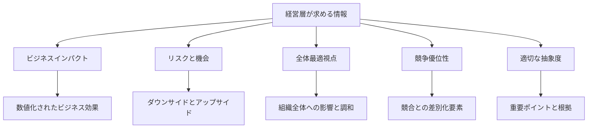

**階層別の関心事の違い**：

| 階層 | 主な関心事 | 時間的視点 | 求める情報の粒度 |
|------|------------|------------|------------------|
| 現場管理職 | 業務効率、品質、実行性 | 日次〜月次 | 詳細な実務情報 |
| 部門長 | 部門目標達成、リソース配分 | 月次〜四半期 | 概要と重要詳細 |
| 役員・経営層 | 戦略目標、投資判断、リスク管理 | 四半期〜年次以上 | ハイレベルの要約と影響 |

**経営層向け情報提供の原則**：

1. **「だから何？」に答える**
   - 情報の先にある意味や影響を明確に
   - 「この情報が示唆するのは...」

2. **選択肢と推奨案を提示する**
   - 単なる報告ではなく判断材料を提供
   - それぞれの選択肢のメリット・デメリット

3. **数値とストーリーを組み合わせる**
   - 定量的データと意味のある解釈
   - 数字だけでなく、その文脈や意味

**日常レッスン**：次回、上層部への報告を準備する際、「この情報はビジネスにどのようなインパクトをもたらすのか」という視点で内容を見直し、財務的・戦略的影響を明確にしましょう。

### 5-2 簡潔かつ本質的な報告の仕方

役員や上層部への報告では、限られた時間の中で本質的な情報を簡潔に伝えることが求められます。彼らの意思決定に役立つ報告の仕方を身につけましょう。

**PREP法による報告構成**：

1. **Point（結論）**
   - 最も伝えたいこと、意思決定してほしいこと
   - 例：「今四半期の売上は目標を15%上回り、特に新商品Xが貢献しています」

2. **Reason（理由）**
   - 結論を裏付ける主な理由や根拠
   - 例：「新商品Xは競合より20%高性能で、顧客満足度も95%と高評価です」

3. **Example（具体例）**
   - 理由を補強する具体的な事例やデータ
   - 例：「特にA社では、導入後3か月で生産性が30%向上しました」

4. **Point（結論の再確認）**
   - 最初の結論を再確認し、次のアクションを示す
   - 例：「引き続き新商品Xに注力し、来期は海外展開を提案します」

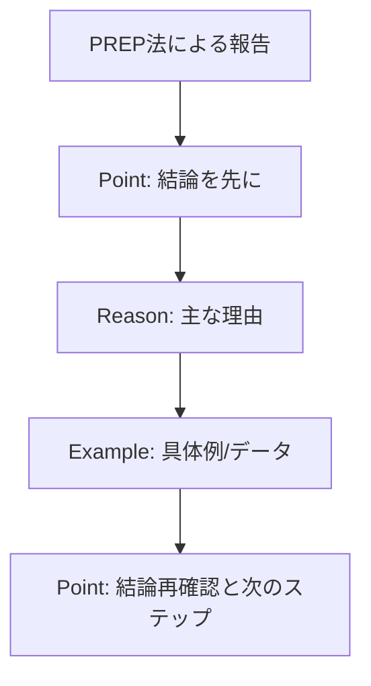

**エグゼクティブサマリーの作成法**：

エグゼクティブサマリーは、忙しい経営層が短時間で状況を把握できるよう設計された要約です。

1. **全体を1ページにまとめる**
   - A4用紙1枚に収まるように厳選
   - 余白を適切に取り、読みやすさを確保

2. **構造化された情報提示**
   - 見出しと箇条書きで構造化
   - 表や図で複雑な情報を視覚化

3. **必須要素の網羅**
   - 現状（What）：何が起きているか
   - 影響（So What）：なぜ重要か
   - 対応（Now What）：どう対応すべきか

4. **数値とビジネス言語の使用**
   - 感覚的表現ではなく具体的数値
   - 業界・経営用語の適切な使用

**日常レッスン**：次回の重要な報告前に、その内容を30秒で説明するとしたら何を伝えるかを考え、メモに書き出してみましょう。これが本当に伝えるべき本質です。

### 5-3 数字とビジネスインパクトを伝える技術

役員や経営層とのコミュニケーションでは、数字を効果的に活用し、ビジネスインパクトを明確に伝えることが重要です。数字は客観性を高め、判断材料となります。

**数字を効果的に伝える5つの技術**：

1. **文脈化**
   - 単なる数字ではなく、その意味を説明
   - 例：「売上20%増」→「業界平均の2倍のペースで成長」

2. **比較の活用**
   - 過去、計画、業界平均、競合との比較
   - 例：「前年比15%増、計画比5%増、業界平均の3倍の成長率」

3. **トレンドの提示**
   - 単発の数字よりも推移やパターンを示す
   - 例：「3四半期連続で成長率が加速している」

4. **適切な粒度**
   - 詳細すぎず、大雑把すぎない適切なレベル
   - 例：製品カテゴリー別の数字（個別SKUではなく）

5. **視覚化**
   - グラフや図で傾向や比較を視覚的に表現
   - 複雑なデータも直感的に理解できる

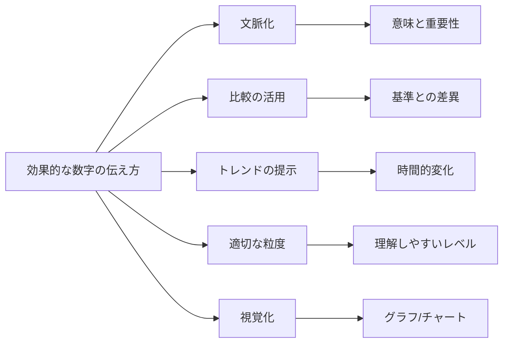

**ビジネスインパクトを伝えるフレームワーク**：

1. **財務的インパクト**
   - 売上、利益、コスト、キャッシュフローへの影響
   - 投資対効果、回収期間

2. **顧客インパクト**
   - 顧客満足度、継続率、シェア拡大
   - 新規顧客獲得、顧客単価向上

3. **オペレーショナルインパクト**
   - 効率性、生産性、品質、スピード
   - リソース最適化、プロセス改善

4. **戦略的インパクト**
   - 競争優位性、市場ポジショニング
   - 長期的成長機会、新市場開拓

5. **リスク要因**
   - 潜在的なダウンサイド、不確実性
   - 緩和策と代替案

**日常レッスン**：次回の報告で数字を使う際、単に「●●が××%」と言うのではなく、必ず「これは△△と比べて◇◇であり、□□を意味する」という文脈を加える習慣をつけましょう。

### 5-4 質疑応答の準備と対応方法

役員や上層部との会議では、プレゼンテーションと同じくらい質疑応答が重要です。質問に的確に答えられるかどうかが、信頼性と説得力を左右します。

**質疑応答の準備段階**：

1. **予想質問リストの作成**
   - 提案の弱点や不確実性に関する質問
   - 数字の根拠や前提条件に関する質問
   - 実行段階の課題に関する質問
   - 代替案や比較に関する質問

2. **ロジックツリーの準備**
   - 質問のカテゴリー分けと構造化
   - 各カテゴリーごとの回答ポイント整理

3. **データと根拠の整理**
   - 補足データや詳細分析の準備
   - 主張を裏付ける具体例の収集

4. **専門家の関与**
   - 必要に応じて専門家を同席させる
   - 詳細な技術質問への対応準備

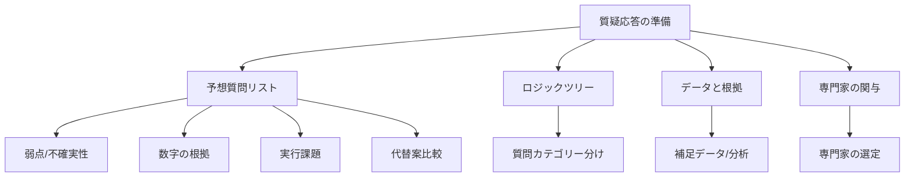

**質問への効果的な対応方法**：

1. **PREP法による回答**
   - Point（結論）：質問への直接的な回答
   - Reason（理由）：回答の根拠
   - Example（例）：具体例や証拠
   - Point（結論）：回答の再確認

2. **未知の質問への対応**
   - 正直に認めつつ、わかる範囲で回答
   - 「調査して後ほど回答します」と期限を示す

3. **批判的質問への対応**
   - 防衛的にならず、建設的に受け止める
   - 質問の背後にある懸念を理解して対応

4. **多角的な視点の示し方**
   - 複数の観点からの検討を示す
   - リスクと対策の両面を示す

**日常レッスン**：次回の重要なプレゼンテーション前に、「この提案のリスクや弱点は何か」「どのような反論があり得るか」という視点で3-5の質問を予想し、回答を準備しましょう。

### コラム：「役員会議で成功した伝え方の秘訣」

---

**役員会議で成功した伝え方の秘訣**

ある大手製造業の中堅マネージャー、村田さんは、かつて役員会議での報告が苦手でした。技術畑出身の彼は詳細な分析と正確さを重視するあまり、役員たちの目が徐々に曇っていくのを何度も経験していました。

しかし、ある日の大型設備投資の提案が転機となりました。その日、村田さんはいつもと違うアプローチを試みたのです。

**転機となった報告**

村田さんは5分間の持ち時間で、次のように話し始めました：

「本日は2億円の設備投資提案です。この投資により、年間5000万円のコスト削減が見込め、投資回収期間は4年です。さらに、品質不良率を現在の3%から1%未満に抑えられ、A社のような高品質要求顧客への対応力が大幅に向上します。」

役員たちの表情が一変しました。通常なら技術仕様や設備の詳細説明から始まる報告が、いきなりビジネスインパクトから始まったのです。

**成功の3つの秘訣**

後に村田さんが語ったところによると、彼が実践したのは次の3つの秘訣でした：

1. **逆ピラミッド構造**
   技術者は積み上げ型の説明（詳細→結論）を好みますが、役員会議では逆ピラミッド構造（結論→根拠→詳細）が効果的です。最も重要な結論と意思決定ポイントを最初に提示することで、聞き手の関心を引きつけます。

2. **3つの数字ルール**
   村田さんは「役員が記憶できる数字は3つまで」という原則を守りました。彼の場合は「投資額2億円」「年間削減額5000万円」「不良率1%未満」の3つです。それ以外の数字は補足資料に回しました。

3. **意思決定フレームワーク**
   提案を「投資額」「期待リターン」「リスク」「代替案」という意思決定者の視点で構造化しました。意思決定者が判断しやすいよう情報を整理したのです。

**予想質問への準備**

さらに村田さんは、想定される質問を予め準備していました：
- 「なぜ今この投資が必要なのか？」
- 「投資額をもっと抑える方法はないのか？」
- 「この技術は5年後も陳腐化しないのか？」

こうした質問に対する回答も、データと具体例を交えて準備していました。

**信頼を築く誠実さ**

村田さんの報告で最も印象的だったのは、リスクについても正直に言及したことでした。
「この設備導入の最大のリスクは、立ち上げ期間中の生産調整です。これについては、別ラインでの前倒し生産で対応します」

この誠実さが、逆に役員たちの信頼を高めることになりました。

**教訓**

役員会議での成功の鍵は、情報量ではなく、情報の「質」と「構造」にあります。相手の立場で「何を判断するために必要な情報か」を考え、簡潔に構造化することで、複雑な内容でも効果的に伝えることができるのです。

---

## 第6章：文書作成の実践テクニック

### 6-1 目的別文書の構成法

ビジネス文書は目的によって最適な構成が異なります。文書の目的を明確にし、それに合わせた構成を選ぶことで、効果的なコミュニケーションが可能になります。

**主な文書タイプと最適構成**：

1. **情報共有型文書**
   - 目的：事実や状況を伝える
   - 構成：要約→重要ポイント→詳細→補足情報
   - 例：議事録、状況報告書、情報メモ

2. **提案型文書**
   - 目的：アイデアや計画を提案し承認を得る
   - 構成：提案概要→背景・課題→提案内容→期待効果→実施計画
   - 例：企画書、提案書、申請書

3. **分析型文書**
   - 目的：データの分析結果と洞察を伝える
   - 構成：結論→主な発見→分析方法→詳細結果→提言
   - 例：分析レポート、調査報告書、市場分析

4. **指示型文書**
   - 目的：行動や手順を指示する
   - 構成：目的→全体概要→ステップ別手順→注意点→問い合わせ先
   - 例：マニュアル、手順書、業務指示書

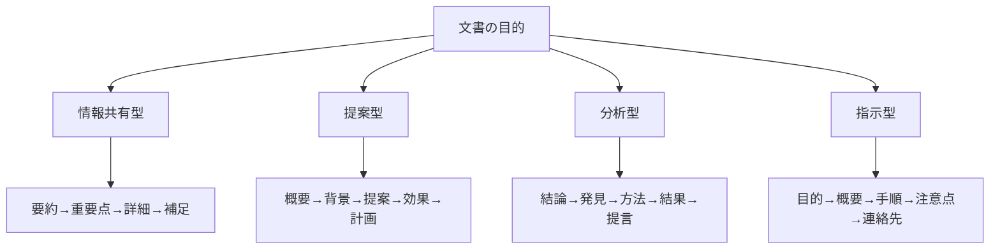

**文書構成の基本原則**：

1. **階層構造の活用**
   - 見出しとサブ見出しで階層化
   - 重要度に応じて情報を整理

2. **スキャンしやすさの確保**
   - 重要ポイントを目立たせる
   - 箇条書きやハイライトの活用

3. **情報密度の調整**
   - 主要部分は詳細に、補足は簡潔に
   - 図表を効果的に活用

4. **論理的一貫性の確保**
   - 各セクションの関連性を明確に
   - 前後の流れが自然になるよう配置

**日常レッスン**：次回文書作成の前に、「この文書の主な目的は何か」を明確にし、上記の文書タイプのどれに当てはまるかを考えてから、適切な構成テンプレートを選びましょう。

### 6-2 読み手を惹きつける文章の書き方

どんなに優れた内容でも、読み手を惹きつける書き方ができなければ、メッセージは届きません。特にビジネス環境では、限られた時間と注意力の中で読まれることを意識した文章が重要です。

**読み手を惹きつける5つの技術**：

1. **強い書き出し**
   - 最初の1-2文で関心を引く
   - 重要な事実、驚きの発見、関連性の高い問題提起など

2. **具体性の重視**
   - 抽象的な表現よりも具体的な事例
   - 数字や固有名詞の効果的な使用

3. **メリハリのある文体**
   - 短文と中文の組み合わせ
   - 重要ポイントでの簡潔な表現

4. **視覚的要素の活用**
   - 箇条書き、太字、下線などの強調
   - 図表による視覚的理解の促進

5. **行動喚起の明確化**
   - 読後に期待する行動の明示
   - 期限や条件の具体的提示

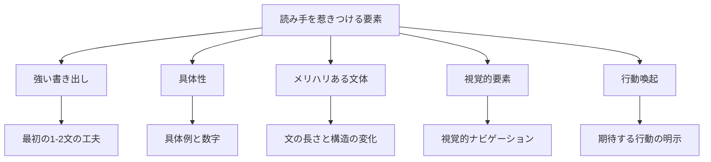

**読み手別のアプローチ**：

| 読み手のタイプ | 特徴 | 効果的なアプローチ |
|----------------|------|-------------------|
| ビジー型（時間なし） | 素早くスキャンしたい | 見出し重視、要約先行、箇条書き多用 |
| 分析型（詳細重視） | 根拠と詳細を求める | 論理構成明確化、データ提示、補足充実 |
| 結果型（成果重視） | インパクトに関心 | 成果・影響を前面に、具体的数値 |
| 関係型（文脈重視） | ストーリーに関心 | 背景説明、人的要素、全体像 |

**効果的な見出しの作り方**：

1. **情報提供型**
   - 内容を端的に要約
   - 例：「第3四半期の売上は前年比15%増加」

2. **疑問型**
   - 読者の疑問を先取り
   - 例：「なぜ顧客満足度が急上昇したのか？」

3. **行動喚起型**
   - 期待する行動を明示
   - 例：「新システム導入に向けた3つの準備ステップ」

4. **利益提示型**
   - 読むことのメリットを示す
   - 例：「5分で理解できる予算計画の要点」

**日常レッスン**：次回の重要文書を書く際、書き終えた後に各段落の最初の文だけを読み返してみましょう。それだけで内容の流れが理解できるか確認し、必要に応じて最初の文を強化してください。

### 6-3 推敲と削減の具体的方法

文章の質を高めるためには、初稿完成後の推敲と削減のプロセスが不可欠です。特にビジネス文書では、簡潔さと明確さを実現するための具体的な推敲方法を身につけることが重要です。

**効果的な推敲の5ステップ**：

1. **構造の確認**
   - 論理的な流れになっているか
   - 重要な情報が適切な位置にあるか

2. **無駄の排除**
   - 重複している内容はないか
   - 目的に関係ない情報はないか

3. **明確さの向上**
   - 曖昧な表現や抽象的な言葉はないか
   - 専門用語は適切に使用されているか

4. **簡潔さの強化**
   - 冗長な表現、余分な修飾語はないか
   - 一文が長すぎないか

5. **表現の統一**
   - 用語や表記は一貫しているか
   - トーンや視点は統一されているか

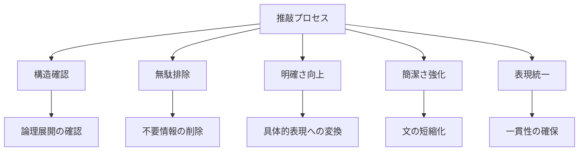

**削減のための具体的テクニック**：

1. **修飾語の削減法**
   - 形容詞・副詞の必要性を厳しく吟味
   - 例：「非常に重要な問題」→「重要な問題」または単に「問題」

2. **一文一義の徹底**
   - 一つの文に複数の内容を詰め込まない
   - 長文は複数の短文に分割する

3. **冗長表現の置き換え**
   - 「～することができる」→「～できる」
   - 「～という事実」→「～」

4. **受動態から能動態へ**
   - 「検討された」→「検討した」
   - 「実施される予定です」→「実施します」

5. **名詞化表現の動詞化**
   - 「実施を行う」→「実施する」
   - 「検討を進める」→「検討する」

**推敲チェックリスト**：

- □ 目的に合った構成になっているか
- □ 重要なポイントが冒頭に示されているか
- □ 各段落は一つのトピックに集中しているか
- □ 不要な情報や説明はないか
- □ 全ての文は明確で誤解の余地はないか
- □ 長すぎる文やわかりにくい文はないか
- □ 用語と表記は一貫しているか
- □ 全体の長さは適切か

**日常レッスン**：次回の重要文書を書いた後、一晩置いてから読み返し、上記チェックリストで確認してみましょう。特に「この文書の20%を削るとしたらどこを削るか」という観点で見直すと効果的です。

### 6-4 ビジュアル要素の効果的な活用

文章だけでなく、ビジュアル要素を効果的に活用することで、情報の伝達力と理解度を大幅に高めることができます。特に複雑なデータや関係性を伝える際に有効です。

**主なビジュアル要素とその適用場面**：

1. **表（テーブル）**
   - 用途：複数項目の比較、詳細データの整理
   - 例：製品スペック比較、予算内訳、スケジュール

2. **グラフ**
   - 用途：数値データのパターンや関係性の表示
   - 例：
     - 折れ線グラフ：時系列変化
     - 棒グラフ：項目間比較
     - 円グラフ：構成比率
     - 散布図：相関関係

3. **図解・ダイアグラム**
   - 用途：概念やプロセスの視覚化
   - 例：組織図、フローチャート、マインドマップ

4. **視覚的強調**
   - 用途：重要ポイントの強調
   - 例：ボックス、色分け、太字、矢印

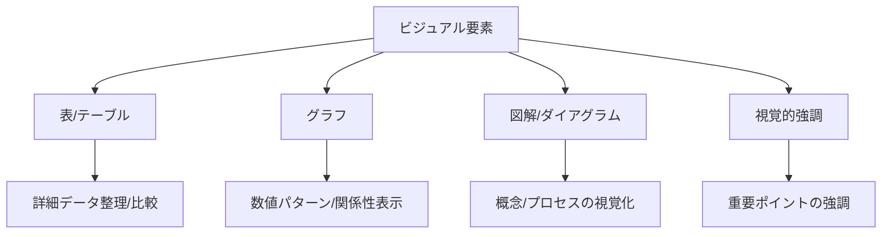

**ビジュアル要素活用の原則**：

1. **目的の明確化**
   - 何を伝えたいのかを明確にする
   - 目的に最適な表現方法を選ぶ

2. **シンプル化**
   - 不要な装飾や情報を排除
   - 一つのビジュアルで一つのメッセージ

3. **コンテキスト提供**
   - タイトルや説明で文脈を明確に
   - 必要な注釈や凡例を付ける

4. **一貫性の維持**
   - 文書全体で統一感のあるスタイル
   - 色使いやフォントの一貫性

**効果的なビジュアル要素の選び方**：

| 伝えたい内容 | 最適なビジュアル要素 |
|--------------|----------------------|
| 時間的変化や傾向 | 折れ線グラフ |
| 項目間の比較 | 横棒グラフ、表 |
| 構成比率 | 円グラフ、100%積み上げ棒グラフ |
| 分布や散らばり | ヒストグラム、散布図 |
| 手順やプロセス | フローチャート、ナンバリング |
| 組織や構造 | 組織図、ツリーダイアグラム |
| 関連性や影響 | 関係図、マインドマップ |

**日常レッスン**：次回の報告書やプレゼン資料を作成する際、文章だけで説明している箇所を見直し、「この情報はビジュアル要素で表現できないか」と考えてみましょう。特に数値データや複雑な関係性は、適切なグラフや図解に変換してみてください。

### ケーススタディ：「改善前と改善後の文書比較」

---

**改善前と改善後の文書比較**

**背景**：
鈴木さんは営業部の中堅社員で、新規サービスの導入提案書を作成することになりました。最初に作成した提案書は情報量が多いものの、要点が不明確で読みにくいものでした。上司からのフィードバックを受け、彼は文書を全面的に改訂しました。

**改善前の提案書（抜粋）**：

```
新規顧客管理システムの導入について

当社では現在、顧客管理に関してExcelを使用した管理を行っておりますが、近年の取引先増加に伴い、情報の更新や共有に時間がかかるようになっています。また、営業担当者ごとに管理方法が異なるため、情報の一貫性にも問題が生じています。さらに、顧客訪問履歴や商談内容の詳細な記録が難しく、担当者が不在の場合に適切な対応ができないケースも発生しています。

このような状況を改善するため、クラウド型の顧客管理システム「CRMプロ」の導入を提案いたします。このシステムは、顧客情報の一元管理、訪問履歴や商談記録の共有、売上予測レポートの自動生成など、様々な機能を有しています。また、モバイル対応しているため、外出先からでもリアルタイムに情報にアクセスすることが可能です。

導入費用としては、初期設定費用が約150万円、その後月額利用料が20万円（50ユーザーライセンス）となります。これに加えて、データ移行費用や社内研修費用などが発生する可能性があります。導入期間は約2〜3ヶ月を想定しており、まずは営業部での試験導入後、全社展開を検討したいと考えております。
```

**問題点**：
- 結論（提案内容）が2段落目まで出てこない
- 段落が長く、視覚的に読みづらい
- 重要ポイントが埋もれている
- 具体的なメリットや投資対効果が不明確
- 読み手に期待するアクションが明示されていない

**改善後の提案書（抜粋）**：

```
新規顧客管理システム導入提案：年間1200万円のコスト削減と営業効率30%向上

【提案概要】
クラウド型顧客管理システム「CRMプロ」の導入により、顧客対応の質向上と営業業務の効率化を実現します。投資回収期間は約14ヶ月、5年間で約5000万円のコスト削減効果が見込まれます。

【現状の課題】
• Excel管理による情報更新・共有の遅延（平均45分/日/人）
• 営業担当者ごとの管理方法の不統一
• 顧客履歴の分断による機会損失（年間約20件の失注事例）
【期待される効果】
1. 営業担当者の工数削減：年間約900時間（約1000万円相当）
2. 情報共有の即時化：顧客対応時間30%短縮
3. 営業機会損失の削減：年間約200万円の売上増加見込み

【導入費用と期間】
• 初期費用：150万円（設定費、データ移行、研修費含む）
• 運用費用：月額20万円（50ユーザーライセンス）
• 導入期間：約2か月（下図スケジュール参照）

【推奨アクション】
4月度経営会議での承認をいただき、5月からの試験導入、7月からの本格運用開始を提案します。

※詳細な機能比較、投資回収計算、導入スケジュールは添付資料をご参照ください。
```

**改善のポイント**：
1. **強いタイトル**：提案の価値（コスト削減と効率向上）を数値付きで明示
2. **結論ファースト**：冒頭に提案概要と投資回収期間を明記
3. **構造化**：見出しと箇条書きで視覚的に読みやすく
4. **数値化**：抽象的な説明ではなく、具体的な数字で効果を提示
5. **アクション明示**：読み手に期待する行動を明確に記載

**結果**：
改善された提案書は、「一目で価値が理解できる」「判断材料が揃っている」と上層部から高く評価されました。結果として提案は承認され、鈴木さんの文書作成能力も社内で評価されるようになりました。

**学び**：
文書の改善は単なる書き換えではなく、「誰に」「何を」「どう判断してもらうか」という視点での再構成が重要です。特に、「読み手の立場で必要な情報は何か」を考え、それを最適な形で提示することが、効果的な文書作成の鍵となります。

---

## 第7章：日常的なコミュニケーション改善レッスン

### 7-1 毎日取り組める簡単なトレーニング

コミュニケーション能力は、日々の小さな積み重ねで確実に向上します。毎日続けられる簡単なトレーニングを習慣化することで、無理なく着実にスキルアップしていきましょう。

**5分間で取り組める7つの日常トレーニング**：

1. **要約力トレーニング**
   - 朝のニュースや記事を3行で要約する
   - 会議の内容を1分で同僚に説明する練習

2. **説明の構造化練習**
   - 何かを説明する前に「1.2.3」と指を折って要点を整理
   - 「結論→理由→例→結論」のPREP法を意識的に使う

3. **「だから何？」フィルター**
   - 伝えようとしている情報に「だから何？」と問いかけ
   - 相手にとっての意味や影響を考える習慣

4. **質問の言い換え練習**
   - 閉じた質問（はい/いいえで答えられる）を開いた質問に言い換える
   - 「これでいいですか？」→「どのような点を改善できますか？」

5. **聞き返しトレーニング**
   - 相手の言ったことを「つまり〜ということですね」と言い換える
   - 理解度を確認しながら会話を進める習慣

6. **削減練習**
   - 書いたメールの文字数を20%削る努力
   - 3分で話そうとしていた内容を2分で話す練習

7. **フィードバック日記**
   - その日に受けたフィードバックの真意を振り返る
   - 「相手は本当は何を言いたかったのか」をメモする

```mermaid
graph TD
    A[日常トレーニング] --> B[要約力]
    A --> C[構造化]
    A --> D[意味の明確化]
    A --> E[質問の工夫]
    A --> F[聞き返し]
    A --> G[削減練習]
    A --> H[振り返り]
    
    B --> I[情報の本質抽出]
    C --> J[論理的整理]
    D --> K[相手視点の考慮]
    E --> L[対話の深化]
    F --> M[理解の確認]
    G --> N[簡潔さの追求]
    H --> O[継続的改善]
```

**継続のためのコツ**：

1. **既存の習慣に紐づける**
   - 朝のコーヒーを飲みながら要約練習
   - 通勤時間にフィードバック振り返り

2. **視覚的なリマインダー**
   - デスクに「結論ファースト」などのメモを貼る
   - スマホの壁紙に目標を設定

3. **小さな成功体験を作る**
   - 「今日は会議で簡潔に説明できた」など小さな成功を認識
   - 同僚や上司から肯定的な反応があったことをメモ

4. **仲間と一緒に取り組む**
   - 同僚と改善目標を共有
   - 互いにフィードバックし合う関係を作る

**21日間チャレンジプラン**：

| 日数 | 朝のトレーニング | 日中の意識ポイント | 夕方の振り返り |
|------|--------------|-----------------|--------------|
| Day 1-7 | 新聞記事の3行要約 | 会話での「結論ファースト」 | フィードバック日記 |
| Day 8-14 | メールの20%削減 | 「だから何？」フィルター | 聞き返し実践の記録 |
| Day 15-21 | PREP法での説明練習 | 質問の言い換え実践 | 成功体験の記録 |

**日常レッスン**：今日から、毎朝5分間だけ、新聞記事や業界ニュースを読んで3行で要約する習慣をつけてみましょう。「この記事で最も重要なことは何か」を意識して抽出してください。

### 7-2 思考の整理法とメモ技術

効果的なコミュニケーションの基礎となるのは、自分の思考を整理する能力です。特にビジネス環境では、複雑な情報を論理的に整理し、必要な時に取り出せるメモ技術が重要です。

**思考整理の4つの基本フレームワーク**：

1. **ロジックツリー**
   - 課題や問題を階層的に分解する
   - 原因分析や選択肢の網羅に効果的

2. **マトリックス法**
   - 2つの軸で情報を整理する
   - 優先順位付けや比較分析に有効

3. **マインドマップ**
   - 中心テーマから放射状に連想を広げる
   - アイデア出しや関連性把握に適する

4. **MECE（ミーシー）**
   - 漏れなく、重複なく情報を整理する
   - 問題の構造化や選択肢の網羅に有効

```mermaid
graph TD
    A[思考整理フレームワーク] --> B[ロジックツリー]
    A --> C[マトリックス法]
    A --> D[マインドマップ]
    A --> E[MECE]
    
    B --> F[階層的分解]
    C --> G[2軸での整理]
    D --> H[放射状連想]
    E --> I[漏れなく重複なく]
```

**効果的なメモ技術**：

1. **構造化メモ法**
   - 階層構造を意識したインデント
   - 関連情報のグルーピング
   - 例：コーネル式メモ法（ノートを区分けして使用）

2. **視覚的メモ法**
   - 図解、矢印、ボックスの活用
   - 関係性の視覚化
   - 例：スケッチノーティング（絵と文字の組み合わせ）

3. **キーワードメモ法**
   - 文章ではなく重要な単語を記録
   - 後からでも文脈を思い出せる工夫
   - 例：マインドマップ式メモ

4. **アクション指向メモ**
   - タスクや決定事項を明確に区別
   - フォローアップが必要な項目をマーク
   - 例：バレットジャーナル方式

**会議や議論のためのメモ実践法**：

1. **準備段階**
   - メモのテンプレートを事前に用意
   - 想定される話題を項目として記載

2. **メモ取り中**
   - 結論や決定事項は特別なマークで強調
   - 疑問点や確認事項は別のマークで区別
   - 自分の考えと他者の発言を区別

3. **整理段階**
   - メモ取り後10分以内に再構成
   - 重要ポイントをハイライト
   - アクション項目の抽出と期限の明記

**日常レッスン**：次回の重要な会議や電話の前に、A4用紙を4分割し、「目的」「主要ポイント」「質問/疑問点」「次のアクション」というセクションを作ってメモを取る準備をしましょう。会議中はこの枠組みを意識してメモを取り、会議後すぐに整理する習慣をつけてください。

### 7-3 聞く力を鍛える方法

効果的なコミュニケーションは「話す力」だけでなく「聞く力」に大きく依存します。特に相手が何を求めているのかを正確に理解するためには、積極的に聞く能力（アクティブリスニング）を鍛えることが重要です。

**アクティブリスニングの5つの要素**：

1. **全身での傾聴**
   - 目線合わせ、前傾姿勢、うなずきなど
   - 相手に「聞いている」ことを伝える非言語サイン

2. **確認と言い換え**
   - 相手の言葉を自分の言葉で言い換える
   - 「つまり〜ということですね」で理解を確認

3. **適切な質問**
   - 閉じた質問と開いた質問を使い分ける
   - 相手の思考を深める質問を心がける

4. **感情への配慮**
   - 言葉の背後にある感情に注意を払う
   - 「〜と感じておられるのですね」と共感を示す

5. **判断の保留**
   - 即座に評価や批判をしない
   - 先入観を脇に置いて話を聞く姿勢

```mermaid
graph TD
    A[アクティブリスニング] --> B[全身での傾聴]
    A --> C[確認と言い換え]
    A --> D[適切な質問]
    A --> E[感情への配慮]
    A --> F[判断の保留]
    
    B --> G[姿勢・目線・うなずき]
    C --> H[理解の確認]
    D --> I[思考を促す問いかけ]
    E --> J[感情の認識と受容]
    F --> K[先入観を脇に置く]
```

**聞く力を鍛えるトレーニング**：

1. **2分間スピーチ練習**
   - パートナーに2分間話してもらい、内容を要約
   - キーポイントと感情の両方を捉える練習

2. **言い換えチャレンジ**
   - 会話の中で相手の言ったことを言い換える
   - 「あなたの言っていることは〜ということですね」

3. **質問の種類を意識する**
   - 日常会話で使う質問の種類を意識する
   - 閉じた質問から開いた質問に変換する練習

4. **感情ワード集め**
   - 感情を表す言葉のレパートリーを増やす
   - 会話の中で相手の感情を言葉にする練習

5. **沈黙の活用**
   - 相手の話の後、すぐに応答せず3秒待つ
   - 相手がさらに考えを深める機会を与える

**聞き手のレベル分類**：

| レベル | 特徴 | 効果 |
|--------|------|------|
| レベル1：聞いていない | 自分の考えに集中、相手の話を遮る | 相手の不満、関係悪化 |
| レベル2：表面的に聞く | 言葉は聞くが深く理解しない | 誤解、情報の取りこぼし |
| レベル3：選択的に聞く | 関心ある部分だけ注意を払う | 部分的理解、偏った解釈 |
| レベル4：積極的に聞く | 全身で集中、言い換え確認 | 正確な理解、信頼構築 |
| レベル5：共感的に聞く | 言葉と感情の両方に注意 | 深い相互理解、強い信頼関係 |

**日常レッスン**：一日一回、重要な会話の際に「今日はレベル4で聞こう」と意識し、相手の話の後に「あなたの言いたいことは〜ということですね」と確認する練習をしましょう。1週間続けると、この確認の習慣が自然に身につき始めます。

### 7-4 自己モニタリングの習慣化

コミュニケーション能力を継続的に向上させるためには、自分のコミュニケーションパターンを客観的に観察し、改善点を見つけ出す「自己モニタリング」の習慣が不可欠です。

**自己モニタリングの4つの側面**：

1. **言語的側面**
   - 使用する語彙、文の長さ、話の構成
   - 専門用語の使用頻度、抽象的表現の多さ

2. **非言語的側面**
   - 声のトーン、話すスピード、間の取り方
   - 姿勢、ジェスチャー、アイコンタクト

3. **相互作用的側面**
   - 相手の反応への注意、質問への対応
   - 対話のバランス、聞く姿勢

4. **状況適応的側面**
   - 場面や相手に応じた調整能力
   - フォーマル/カジュアルの切り替え

```mermaid
graph TD
    A[自己モニタリング] --> B[言語的側面]
    A --> C[非言語的側面]
    A --> D[相互作用的側面]
    A --> E[状況適応的側面]
    
    B --> F[言葉遣い・構成]
    C --> G[話し方・身体表現]
    D --> H[反応・対話バランス]
    E --> I[場面適応力]
```

**自己モニタリングの実践方法**：

1. **事前準備のモニタリング**
   - 重要な会話の前に目標と戦略を設定
   - 「今回は簡潔さを意識する」など具体的なポイント

2. **リアルタイムモニタリング**
   - 会話中に自分の話し方と相手の反応を観察
   - 調整が必要な部分を意識的に修正

3. **事後振り返り**
   - 会話後に何がうまくいき、何が改善できるか分析
   - 具体的な言動とその効果を振り返る

4. **定期的な総括**
   - 週単位や月単位で自分のパターンを分析
   - 改善すべき習慣やクセを特定

**自己モニタリングのためのツール**：

1. **コミュニケーション日記**
   - 重要な会話の内容と効果を記録
   - 成功事例と改善点をパターン化

2. **録音・録画分析**
   - 許可を得た上での会話の録音や録画
   - 客観的な視点での自己分析

3. **フィードバックリクエスト**
   - 信頼できる人に特定の観点でフィードバックを依頼
   - 「話が長くなっていないか教えて」など具体的に

4. **チェックリスト活用**
   - 自分の課題に特化したチェックリストの作成
   - 会話前後での自己評価

**自己モニタリングカレンダーの例**：

| 曜日 | 焦点を当てる側面 | チェックポイント |
|------|------------------|------------------|
| 月曜 | 言語的側面 | 簡潔さ、結論ファースト |
| 火曜 | 非言語的側面 | 声のトーン、姿勢 |
| 水曜 | 相互作用 | 質問の質、聞く姿勢 |
| 木曜 | 状況適応 | 場面に応じた調整 |
| 金曜 | 総合実践 | すべての側面の統合 |

**日常レッスン**：今週から、毎日の終わりに5分間、その日の重要なコミュニケーション場面を1つ選び、「うまくいったこと」と「次回に改善したいこと」をメモする習慣をつけましょう。週末にはそのメモを見返し、パターンを分析してみてください。

### コラム：「1ヶ月で変わった私のコミュニケーション」

---

**1ヶ月で変わった私のコミュニケーション**

エンジニアの山田さん（仮名）は、技術力は高いものの「説明が冗長でわかりにくい」という評価を受けることが多く悩んでいました。特に非技術部門や経営層に対しての報告がうまくいかず、キャリアの壁を感じていました。

**きっかけ**

ある日の経営会議で、山田さんが10分の持ち時間で新システムの説明をしていると、5分経過したところで社長から「結論は何ですか？」と遮られました。慌てて要点をまとめようとしましたが、うまく伝えられず、会議後に上司から「もっと簡潔に伝える訓練が必要だ」と言われました。

**1ヶ月の取り組み**

山田さんは、次の4つの小さな習慣を1ヶ月続けてみることにしました。

1. **朝の3行要約**
   毎朝、技術ニュースを読んで3行に要約する練習を始めました。最初は「重要な情報が省略できない」と感じましたが、次第に本質を見極める力がついてきました。

2. **「だから何？」の問いかけ**
   メールを送る前、説明を始める前に「だから相手にとって何が重要なのか？」と自問するようにしました。これにより、相手視点での情報の取捨選択ができるようになりました。

3. **リバースPREP法**
   重要な説明の前に紙に「結論→理由→例→結論」の順でメモを作り、構造を可視化してから話すようにしました。

4. **フィードバックメモ**
   説明後に相手の反応をメモし、「何が伝わり、何が伝わらなかったか」を振り返る習慣をつけました。

**変化の兆し**

2週間ほど経ったある日、チーム会議で新機能の説明をした際、普段は静かな先輩から「今日の説明はわかりやすかった」と言われました。3週間目には、部長から「最近、報告が簡潔になってきたね」と声をかけられました。

**劇的な変化**

1ヶ月後、再び経営会議で報告する機会がありました。今回、山田さんは次のように話し始めました：

「新システムの導入により、顧客対応時間が40%短縮され、年間約2000万円のコスト削減が見込めます。主な改善点は3つあります。第一に…」

報告後、なんと社長から「非常にクリアな説明だった」とコメントをもらい、他の役員からも具体的な質問が複数出ました。山田さんは初めて、自分の提案が本当に検討されていると実感しました。

**気づき**

山田さんが1ヶ月の取り組みから学んだことは：

1. シンプルさは「情報を削ること」ではなく「本質を際立たせること」
2. 技術的に正確であることと、伝わることは別の課題
3. 相手の立場で「これは重要か？」と常に問いかけることの重要性
4. 小さな習慣の積み重ねが、大きな変化をもたらすこと

この経験から、コミュニケーション改善は特別なスキルではなく、日々の意識と小さな実践の積み重ねだと山田さんは確信しました。そして今では、技術チームの若手にも同じアドバイスをしているそうです。

---

## 第8章：実践チェックリストとテンプレート集

### 8-1 依頼を受けた時のヒアリングチェックリスト

タスクや依頼を受ける際、初期段階で適切な情報を収集することが、後の手戻りや誤解を防ぐ鍵となります。以下のチェックリストを活用して、必要な情報を漏れなく確認しましょう。

**依頼内容の明確化チェックリスト**：

□ **目的**
- □ この依頼の最終的な目的は何か
- □ なぜ今これが必要なのか
- □ どのような判断や決定に使われるのか

□ **成果物**
- □ 最終的に何を提出すべきか（形式、媒体）
- □ どのようなフォーマットや構成が求められているか
- □ 参考にすべき過去の例はあるか

□ **範囲と深さ**
- □ どこまでカバーすべきか（範囲）
- □ どの程度詳細に調査・分析すべきか（深さ）
- □ 特に重点を置くべき部分はあるか

□ **締切と中間確認**
- □ 最終締切はいつか
- □ 中間報告や経過確認は必要か
- □ 優先順位（他の業務との関係）

□ **関係者と承認プロセス**
- □ 最終的な承認者は誰か
- □ 途中で確認すべき関係者は誰か
- □ 情報収集のために連絡すべき人は誰か

□ **制約条件**
- □ 予算や時間の制約はあるか
- □ 使用すべき/避けるべきデータや情報源はあるか
- □ 考慮すべき前提条件やリスクはあるか

```mermaid
graph TD
    A[依頼ヒアリング] --> B[目的]
    A --> C[成果物]
    A --> D[範囲と深さ]
    A --> E[締切]
    A --> F[関係者]
    A --> G[制約条件]
    
    B --> B1[Why - なぜ必要か]
    C --> C1[What - 何を作るか]
    D --> D1[How far - どこまでやるか]
    E --> E1[When - いつまでに]
    F --> F1[Who - 誰が関わるか]
    G --> G1[Limits - 制限は何か]
```

**ヒアリングの際の効果的な質問例**：

| ヒアリング項目 | 効果的な質問例 |
|----------------|----------------|
| 目的の明確化 | 「この情報/資料は、最終的にどのような判断に使われますか？」 |
| 優先順位の確認 | 「複数の視点がありますが、特に重視すべき点はどれでしょうか？」 |
| 期待の調整 | 「どの程度の詳細さを期待されていますか？」 |
| 成功基準の確認 | 「完成したとき、どのような状態だと成功と言えますか？」 |
| 制約の把握 | 「考慮すべき制約や条件はありますか？」 |

**ヒアリング後の確認プロセス**：

1. **要約の送付**
   - ヒアリングした内容を簡潔に要約
   - 箇条書きで重要ポイントを整理

2. **具体例の提示**
   - 可能であれば、成果物のサンプル案や構成案を示す
   - 「このようなイメージでよいか」確認

3. **スケジュールの提案**
   - 中間報告や途中確認のタイミングを提案
   - マイルストーンの設定

**日常レッスン**：次回の依頼を受ける際、このチェックリストを印刷して手元に置き、すべての項目について確認してみましょう。確認後、「私の理解では〜ということですが、それで合っていますか？」と依頼者に確認することを忘れないでください。

### 8-2 報告書・申請書作成のためのテンプレート

効果的な報告書や申請書を作成するためには、目的に応じた適切な構成が重要です。以下に、状況別のテンプレートを示します。これらをカスタマイズして活用してください。

**1. 基本的な業務報告書テンプレート**：

```
【タイトル】簡潔かつ内容を反映したタイトル

【要旨】（200字以内）
※報告の主要ポイントと重要な結論をまとめる

【背景と目的】
・なぜこの報告が必要か
・何を達成するためのものか

【現状と分析】
・主要な事実と数値
・原因や要因の分析
・重要なポイントの強調

【課題と対応策】
・明確になった課題
・推奨される対応策
・実施に必要なリソース

【結論と次のステップ】
・重要ポイントの再確認
・具体的なアクションと担当者
・タイムラインと期待される成果

【添付資料】
・詳細データや補足情報のリスト
```

**2. 役員向け提案・申請書テンプレート**：

```
【提案タイトル】目的と価値を含めた明確なタイトル

【エグゼクティブサマリー】（半ページ以内）
※ビジネスインパクトを強調した要約

【現状と課題】
・現在の状況（数値データ含む）
・事業への影響とリスク
・対応の必要性

【提案内容】
・提案の概要
・実施方法と段階
・差別化ポイント/独自性

【期待される効果】
・定量的効果（数値で示す）
・定性的効果
・ROIまたは投資回収の見通し

【リソースと実施計画】
・必要な予算と人員
・実施スケジュール
・主要マイルストーン

【リスクと対策】
・想定されるリスク
・対応策と代替案
・モニタリング方法

【意思決定事項】
・具体的な承認事項
・決定必要時期
・次のステップ
```

**3. 問題解決型報告書テンプレート**：

```
【課題タイトル】問題の本質を示すタイトル

【重要度とインパクト】
※なぜこの問題が重要か、放置した場合の影響

【問題の詳細】
・問題の具体的症状
・発生時期と頻度
・影響範囲と規模

【原因分析】
・根本原因の特定
・寄与要因の分析
・証拠と根拠

【解決策の検討】
・選択肢A：内容、メリット/デメリット、コスト
・選択肢B：内容、メリット/デメリット、コスト
・選択肢C：内容、メリット/デメリット、コスト

【推奨案と理由】
・最適解の提案
・選定理由
・期待される効果

【実施計画】
・アクションステップ
・担当者と役割
・タイムライン
・進捗確認方法
```

```mermaid
graph TD
    A[報告書・申請書の種類] --> B[業務報告書]
    A --> C[役員向け提案書]
    A --> D[問題解決型報告書]
    
    B --> B1[事実中心/状況説明型]
    C --> C1[意思決定/承認獲得型]
    D --> D1[課題解決/対策提案型]
    
    B1 --> B2[要旨→背景→現状→結論]
    C1 --> C2[サマリー→効果→計画→判断事項]
    D1 --> D2[問題→原因→選択肢→推奨案]
```

**報告書作成の3つの基本原則**：

1. **読者中心設計**
   - 読み手は誰か、何を求めているかを考慮
   - 読者の知識レベルに合わせた情報量と詳細度

2. **スキャン可能性**
   - 見出し、箇条書き、太字などで視覚的構造化
   - 重要ポイントが素早く把握できる工夫

3. **エビデンスベース**
   - 主張には必ずデータや根拠を伴わせる
   - 感想や個人的見解と事実を明確に区別

**日常レッスン**：次回の報告書作成時には、まず適切なテンプレートを選び、書き始める前に各セクションのポイントをメモしてから執筆を始めましょう。特に「この報告書で最も伝えたいことは何か」を明確にし、エグゼクティブサマリーに反映させてください。

### 8-3 プレゼンテーション準備チェックリスト

効果的なプレゼンテーションは、内容だけでなく、準備プロセスの質にも大きく左右されます。以下のチェックリストを活用して、漏れのない準備を心がけましょう。

**プレゼンテーション準備チェックリスト**：

□ **目的と対象の明確化**
- □ このプレゼンの具体的な目的は何か（情報共有・説得・意思決定・教育など）
- □ 聴衆は誰か（役職・専門性・予備知識・関心事）
- □ 聴衆に期待するアクションは何か

□ **内容の構成**
- □ 冒頭で注目を集める導入になっているか
- □ 全体構成は論理的で流れがあるか
- □ メインメッセージは3-5点に絞られているか
- □ 結論と次のステップが明確か

□ **スライドデザイン**
- □ 一貫したデザインテーマを適用しているか
- □ 1スライドあたりの情報量は適切か
- □ 文字の大きさ・色は読みやすいか
- □ 図表は目的を明確に伝えるか

□ **説得力の強化**
- □ 主張を裏付けるデータや根拠があるか
- □ 具体例やストーリーで理解を促進しているか
- □ 反論や質問への準備はあるか
- □ 聴衆の視点から見て価値のある内容か

□ **効果的な実施計画**
- □ 時間配分は適切か（特に重要ポイントに時間を確保）
- □ リハーサルは十分に行ったか
- □ 環境・機材のチェックは済んでいるか
- □ ハンドアウトや補足資料は用意したか

```mermaid
flowchart TD
    A[プレゼン準備プロセス] --> B[目的・対象設定]
    B --> C[内容構成]
    C --> D[スライド作成]
    D --> E[説得力強化]
    E --> F[デリバリー準備]
    F --> G[リハーサル]
    G --> H[最終調整]
    
    B --> B1{目的は明確か}
    B1 -->|NO| B
    B1 -->|YES| C
    
    C --> C1{構成は論理的か}
    C1 -->|NO| C
    C1 -->|YES| D
    
    D --> D1{情報量は適切か}
    D1 -->|NO| D
    D1 -->|YES| E
    
    E --> E1{根拠は十分か}
    E1 -->|NO| E
    E1 -->|YES| F
```

**聴衆タイプ別のアプローチ**：

| 聴衆タイプ | 特徴 | 効果的なアプローチ |
|------------|------|-------------------|
| 意思決定者 | 本質と影響を求める | 結論ファースト、数値重視、選択肢と推奨案 |
| 専門家 | 詳細と正確さを求める | データの深堀り、方法論の説明、技術的根拠 |
| 実務担当者 | 実用性を求める | 具体的手順、事例、実施上の注意点 |
| 多様な聴衆 | 理解度に差がある | 階層化された情報、基本と詳細の区別 |

**プレゼン時間別の構成目安**：

| 持ち時間 | スライド枚数 | 構成の目安 |
|----------|--------------|------------|
| 5分 | 3-5枚 | 結論1+裏付け2-3+次ステップ1 |
| 10分 | 5-8枚 | 導入1+結論1+主要点3-5+まとめ1 |
| 20分 | 10-15枚 | 導入2+概要1+主要点5-8+Q&A対策2+まとめ2 |
| 30分以上 | 15-25枚 | 導入3+背景2+主要点8-12+詳細展開5-8+まとめ2 |

**日常レッスン**：次回のプレゼンテーション準備時には、スライド作成に入る前に、まず「このプレゼンで最も伝えたいメッセージは何か」「聴衆に何を持ち帰ってほしいか」を1文で書き出してみましょう。それがプレゼンテーション全体の方向性を決める羅針盤となります。

### 8-4 会議での発言内容確認シート

会議は情報共有や意思決定の重要な場ですが、効果的な発言ができなければ、その価値を十分に活かせません。以下のシートを活用して、会議での発言内容を事前に整理しましょう。

**会議発言準備シート**：

```
【会議の目的】
※この会議で達成すべきことは何か

【自分の役割】
※情報提供者、意思決定者、ファシリテーターなど

【主要な発言ポイント】
1. 
2. 
3. 

【各ポイントの詳細】
＜ポイント1＞
・伝えるべき事実：
・自分の意見/提案：
・理由/根拠：

＜ポイント2＞
・伝えるべき事実：
・自分の意見/提案：
・理由/根拠：

＜ポイント3＞
・伝えるべき事実：
・自分の意見/提案：
・理由/根拠：

【予想される質問と回答】
Q1: 
A1: 

Q2: 
A2: 

【必要な資料・データ】
・
・

【会議後のフォローアップ】
・
・
```

**会議タイプ別の発言戦略**：

1. **情報共有型会議**
   - PREP法（Point-Reason-Example-Point）で簡潔に
   - 事実と見解を明確に区別
   - 質問を歓迎する姿勢

2. **意思決定型会議**
   - 選択肢とその影響を明確に
   - 自分の推奨案と理由を簡潔に
   - データに基づく根拠の提示

3. **問題解決型会議**
   - 問題の本質を簡潔に定義
   - 原因分析と解決案の提示
   - 建設的な提案を心がける

4. **アイデア創出型会議**
   - 他者のアイデアに肯定的に反応
   - 「Yes, and...」の姿勢
   - 具体的なアイデアの提供

```mermaid
graph TD
    A[発言の基本構造] --> B[結論/主張]
    B --> C[理由/根拠]
    C --> D[具体例/データ]
    D --> E[結論再確認]
    
    B --> F[何を言いたいのか]
    C --> G[なぜそう考えるのか]
    D --> H[どんな証拠があるのか]
    E --> I[何を持ち帰ってほしいか]
```

**効果的な発言のための5つのポイント**：

1. **簡潔さ**
   - 30秒〜2分を目安に
   - 一度の発言で1つのポイントに集中

2. **構造化**
   - 結論→理由→例→結論の順で
   - 番号付け（「3点あります。第一に...」）

3. **具体性**
   - 抽象的表現を避け、具体例を示す
   - 数字や固有名詞で説得力を高める

4. **建設性**
   - 批判だけでなく代替案も示す
   - 「〜ではないか」ではなく「〜してはどうか」

5. **傾聴との連携**
   - 他者の発言を受けての発言
   - 「〜さんの意見に追加して」などの連携

**日常レッスン**：次回の重要な会議前に、この発言準備シートに記入してみましょう。特に「主要な発言ポイント」を3つに絞り込むことを意識してください。また、それぞれの発言を2分以内で伝えられるよう練習してみましょう。

### ワークシート：「自分のコミュニケーションスタイル診断」

自分のコミュニケーションスタイルの特徴を理解することは、改善の第一歩です。このワークシートを活用して、自分の強みと改善点を客観的に把握しましょう。

**コミュニケーションスタイル診断**：

以下の各項目について、1（全くそうでない）〜5（非常にそうである）の5段階で自己評価してください。

**A. 構造化能力**
1. 話の要点を最初に伝えることが多い　　　　　 1-2-3-4-5
2. 情報を論理的な順序で伝えられる　　　　　　 1-2-3-4-5
3. 複雑な情報を整理して説明できる　　　　　　 1-2-3-4-5
4. 話の全体像を示してから詳細に入る　　　　　 1-2-3-4-5
5. 話に明確な始まり、中間、終わりがある　　　 1-2-3-4-5

**B. 簡潔性**
1. 必要最小限の言葉で伝えることができる　　　 1-2-3-4-5
2. 重要でない詳細は省略できる　　　　　　　　 1-2-3-4-5
3. 一文が長くなりすぎない　　　　　　　　　　 1-2-3-4-5
4. 冗長な表現や無駄な修飾語を避ける　　　　　 1-2-3-4-5
5. 本題からそれることなく話せる　　　　　　　 1-2-3-4-5

**C. 聴く力**
1. 相手の話を遮らずに最後まで聞ける　　　　　 1-2-3-4-5
2. 相手の言葉を言い換えて確認する　　　　　　 1-2-3-4-5
3. 質問を通じて相手の考えを引き出せる　　　　 1-2-3-4-5
4. 言葉の背後にある感情や意図を察知できる　　 1-2-3-4-5
5. 先入観を持たずに話を聞ける　　　　　　　　 1-2-3-4-5

**D. 相手適応力**
1. 相手の知識レベルに合わせて説明できる　　　 1-2-3-4-5
2. 専門用語の使用を適切に調整できる　　　　　 1-2-3-4-5
3. 相手の関心事に合わせて内容を調整できる　　 1-2-3-4-5
4. 相手の反応を見て話し方を変えられる　　　　 1-2-3-4-5
5. 異なるコミュニケーションスタイルの人とも
   うまく意思疎通できる　　　　　　　　　　　 1-2-3-4-5

**E. 明確性**
1. 具体的な例を使って説明できる　　　　　　　 1-2-3-4-5
2. 抽象的な概念を分かりやすく伝えられる　　　 1-2-3-4-5
3. 曖昧な表現を避け、明確な言葉を使う　　　　 1-2-3-4-5
4. 専門用語を適切に定義して使用できる　　　　 1-2-3-4-5
5. 複雑な情報を視覚的に表現できる　　　　　　 1-2-3-4-5

**採点と分析**：
各カテゴリー（A〜E）の合計点を計算してください。
- 21-25点：非常に高い（強み）
- 16-20点：高い（おおむね良好）
- 11-15点：中程度（改善の余地あり）
- 6-10点：低い（要改善）
- 5点以下：非常に低い（最優先で改善）

**自己分析**：
1. 最も点数の高かったカテゴリー（強み）：
2. 最も点数の低かったカテゴリー（改善点）：
3. 具体的に改善したい行動や習慣：
4. 今後1か月で取り組む3つの小さな習慣：
   ①
   ②
   ③

```mermaid
radar
    title コミュニケーションスタイル診断例
    A.構造化能力: 18
    B.簡潔性: 12
    C.聴く力: 20
    D.相手適応力: 15
    E.明確性: 14
```

**日常レッスン**：このワークシートに記入した後、特に改善したいカテゴリーについて、日常で意識できる小さな行動目標を3つ設定しましょう。たとえば簡潔性が課題なら、「会議での発言を1分以内に収める」「メールを送る前に20%削減する」などの具体的な行動を決めてください。

## 付録：シチュエーション別実践ガイド

### A-1 緊急時の簡潔な報告方法

緊急時には、限られた時間で効率的に情報を伝える能力が求められます。特に危機的状況では、簡潔さと正確さのバランスが重要になります。

**緊急報告の基本構造「SITREP」（Situation Report）**：

1. **状況（Situation）**
   - 何が起きているのか（事象の簡潔な説明）
   - いつ、どこで発生したか（時間と場所）

2. **影響（Impact）**
   - 現在の影響範囲（誰/何が影響を受けているか）
   - 潜在的なリスクや今後の影響予測

3. **対応（Actions Taken）**
   - 現在実施中の対応策
   - 動員されているリソース

4. **必要事項（Requirements）**
   - 追加で必要なリソースや意思決定
   - 支援要請事項

5. **今後の予定（Plan）**
   - 次のステップと対応計画
   - 次回報告のタイミング

```mermaid
graph TD
    A[緊急報告SITREP] --> B[状況]
    A --> C[影響]
    A --> D[対応]
    A --> E[必要事項]
    A --> F[今後の予定]
    
    B --> B1[何が/いつ/どこで]
    C --> C1[現在と将来への影響]
    D --> D1[実施中の対策]
    E --> E1[追加必要リソース]
    F --> F1[次ステップ/次回報告]
```

**緊急報告の例**：

```
【状況】
・本日14:30頃、東京本社サーバールームで火災警報作動
・原因は電源ユニットの過熱、小規模な発煙あり
・人的被害なし、機器への物理的損傷も確認されず

【影響】
・顧客向けWebサービスが15:00から停止中
・約2,000社の顧客に影響
・顧客データの損失はないことを確認済み

【対応】
・IT部門が該当サーバーを隔離、バックアップシステムへ切替中
・顧客サポートチームが対応窓口を設置、問い合わせ対応中
・広報部門がWebサイトとSNSで障害情報を公開

【必要事項】
・復旧作業の優先承認（通常業務時間外の作業が必要）
・顧客への正式通知文の承認（案文は別添）

【今後の予定】
・16:30までにバックアップシステムでサービス再開予定
・原因の詳細調査は明日実施予定
・17:00に状況更新を報告
```

**緊急報告の5つの原則**：

1. **事実と推測の区別**
   - 確認済みの事実と推測を明確に区別
   - 「確認中」「現時点では」などの限定表現を適切に使用

2. **優先順位の明確化**
   - 最も重要な情報から順に伝える
   - 人命 → 環境・資産 → 業務継続の順で優先度を考慮

3. **情報の階層化**
   - 最重要情報は必ず伝える
   - 詳細は「追加情報として」と前置きして補足

4. **定期的な更新**
   - 次回の報告タイミングを明示
   - 「変更がなくても」定期的に状況を共有

5. **完結性**
   - 報告単体で状況が理解できるようにする
   - 聞き手が「次に何をすべきか」判断できる情報を含める

**日常レッスン**：今日から1週間、緊急報告の練習として、毎日の業務終了時に「本日の最重要事項」をSITREP形式で5分以内にまとめる習慣をつけましょう。特に「何が、なぜ重要で、どう対応したか、次に何が必要か」を簡潔に伝える練習になります。

### A-2 技術的内容を非専門家に説明する

技術的な知識を持たない人に複雑な専門内容を伝えることは、ビジネスにおける重要なスキルです。特に上層部への報告や異なる部門との協働では、専門知識の「翻訳者」としての役割が求められます。

**技術説明の5つのステップ**：

1. **目的の明確化**
   - なぜこの説明が必要なのか
   - 相手に何を理解してもらいたいのか
   - どのような判断や行動につなげたいのか

2. **相手の知識レベル確認**
   - 事前知識や基本概念の理解度を確認
   - 共通の言語基盤を構築

3. **類推（アナロジー）の活用**
   - 身近な例えで複雑な概念を説明
   - 相手の知識領域からの類似例を活用

4. **段階的な説明**
   - 基本から応用へ段階的に進める
   - 各ステップで理解確認のチェックポイント

5. **ビジネス価値への接続**
   - 技術的内容がビジネスにもたらす意味
   - 「だから何？」の答えを明確に

```mermaid
graph TD
    A[技術的内容の説明] --> B[目的明確化]
    A --> C[知識レベル確認]
    A --> D[類推活用]
    A --> E[段階的説明]
    A --> F[ビジネス価値接続]
    
    B --> B1[説明の目的と期待]
    C --> C1[前提知識の確認]
    D --> D1[身近な例え話]
    E --> E1[基本から応用へ]
    F --> F1[メリットと意義]
```

**効果的な類推（アナロジー）の例**：

| 技術的概念 | 効果的な類推 |
|------------|--------------|
| データベース | 整理された図書館（本=データ、分類=テーブル、目録=インデックス） |
| クラウドコンピューティング | 電力会社からの電気供給（必要な分だけ使い、インフラ管理は不要） |
| APIインターフェース | レストランのウェイター（注文を伝え、キッチン(システム)から結果を運ぶ） |
| ファイアウォール | 建物の警備員（IDチェック、不審者の排除） |
| 機械学習アルゴリズム | 経験から学ぶ新入社員（データ=経験、モデル=判断基準） |

**専門用語の扱い方**：

1. **必要最小限に抑える**
   - 本当に必要な専門用語だけを使用
   - 可能な限り一般用語に置き換える

2. **導入時に定義する**
   - 初出時に簡潔な定義を提供
   - 類推と組み合わせて理解を促進

3. **一貫性を保つ**
   - 一度導入した用語は同じ意味で使い続ける
   - 同じ概念に複数の用語を使わない

4. **用語集の提供**
   - 必要に応じて主要用語の一覧を用意
   - 視覚的に参照できるようにする

**技術説明の構造例**：

```
1. 背景（なぜこの技術が必要か）
   - 現在の課題や限界
   - ビジネス上の問題点

2. 概念説明（何をするものか）
   - 身近な例えを使った基本説明
   - 「つまり〜のようなものです」

3. 仕組み（どう機能するか）
   - 基本的な動作原理
   - 視覚的図解の活用

4. メリット（なぜ価値があるか）
   - ビジネスへの直接的効果
   - 数字や具体例で価値を示す

5. 実施ステップ（どう進めるか）
   - 実装や導入の基本ステップ
   - タイムラインと必要リソース
```

**日常レッスン**：あなたの専門分野から3つの重要な概念を選び、それぞれについて非専門家にもわかりやすい「類推（アナロジー）」を考えてみましょう。次回の説明機会にこれらを活用し、相手の反応を観察してください。

### A-3 複雑な案件を短時間で説明するコツ

限られた時間の中で複雑な内容を伝えるシチュエーションは、ビジネスの場では日常的に発生します。エレベーターピッチやタイトな会議など、短時間で本質を伝える能力は重要なスキルです。

**短時間説明の基本構造「PREP+」**：

1. **Point（結論）**
   - 最も伝えたいこと、主張
   - 「一番言いたいことは〜です」

2. **Reason（理由）**
   - 結論の根拠、背景
   - 「なぜなら〜だからです」

3. **Example（例）**
   - 具体的な事例、数字
   - 「例えば〜のようなケースがあります」

4. **Point（結論の再確認）**
   - 結論の言い換えや強調
   - 「つまり〜ということです」

5. **+（次のステップ）**
   - 提案や期待するアクション
   - 「次は〜するべきだと考えます」

```mermaid
sequenceDiagram
    participant P1 as Point（結論）
    participant R as Reason（理由）
    participant E as Example（例）
    participant P2 as Point（再確認）
    participant N as Next（次のステップ）
    
    P1->>R: なぜならば
    R->>E: 例えば
    E->>P2: つまり
    P2->>N: 次に
```

**時間別の構成戦略**：

| 持ち時間 | 重点を置く要素 | 構成の目安 |
|----------|----------------|------------|
| 30秒 | 結論+理由 | P(10秒)+R(15秒)+P(5秒) |
| 1分 | 結論+理由+次步 | P(10秒)+R(20秒)+P(10秒)+N(20秒) |
| 2分 | 結論+理由+例+次步 | P(15秒)+R(30秒)+E(30秒)+P(15秒)+N(30秒) |
| 3分 | 全要素をバランス | P(30秒)+R(45秒)+E(45秒)+P(30秒)+N(30秒) |

**情報の階層化テクニック**：

1. **ピラミッド構造法**
   - 最上位の結論から始める
   - 必要に応じて下位層の詳細に降りる
   - 質問があれば更に深い層へ

2. **「見出し」アプローチ**
   - 各ポイントを新聞の見出しのように簡潔に
   - 「このポイントについて詳しく知りたいですか？」

3. **「3×3」ルール**
   - 最大3つの大きなポイント
   - 各ポイントに最大3つの補足

**短時間説明の実例（2分バージョン）**：

```
【Point】
このプロジェクト計画は、コスト30%削減と顧客満足度向上を同時に実現できる画期的な取り組みです。

【Reason】
現在の業務プロセスには5つの無駄が存在し、顧客の待ち時間増加とコスト増加を招いています。私たちの分析によれば、これらの無駄を排除することで大幅な改善が可能です。

【Example】
実際に、パイロット部門で試験的に実施したところ、処理時間が40%短縮され、エラー率も8%から1%未満に改善しました。お客様からのフィードバックも非常に好評です。

【Point】
つまり、このプロジェクトは単なるコスト削減ではなく、サービス品質の向上とスタッフの負担軽減も実現する総合的な改善策なのです。

【Next】
次のステップとして、7月からの全社展開について承認いただき、段階的な実施計画を詳細化したいと考えています。
```

**日常レッスン**：今週取り組んでいるプロジェクトや課題について、30秒、1分、2分バージョンのPREP+構成を準備してみましょう。時間制限を設けて練習し、時間内に収めつつ核心を伝える感覚をつかんでください。

### A-4 メールや文書での効果的な情報伝達

対面やリアルタイムのコミュニケーションとは異なり、メールや文書でのコミュニケーションでは、相手の即時の反応を見ることができません。このため、誤解を防ぎ、確実に情報を伝えるための配慮が必要です。

**ビジネスメールの基本構造**：

1. **件名（Subject）**
   - 内容を端的に表す
   - 必要に応じて「【報告】」「【依頼】」などを前置き
   - 重要度や期限を含める場合も

2. **宛先と挨拶**
   - 適切な敬称
   - 簡潔な時候の挨拶（必要に応じて）

3. **目的明示**
   - メールの目的を最初に述べる
   - 「〜のためにご連絡しました」

4. **本文**
   - 簡潔かつ構造化された内容
   - 箇条書きや番号付けの活用
   - 段落ごとに一つのトピック

5. **期待するアクション**
   - 相手に期待する行動を明確に
   - 期限がある場合は明記

6. **結びの挨拶と署名**
   - 丁寧な結びの言葉
   - 連絡先を含む署名

```mermaid
graph TD
    A[効果的なメール] --> B[明確な件名]
    A --> C[適切な宛先と挨拶]
    A --> D[目的の冒頭提示]
    A --> E[構造化された本文]
    A --> F[アクションの明示]
    A --> G[丁寧な結び]
    
    B --> B1[内容と重要度の表現]
    C --> C1[正しい敬称と挨拶]
    D --> D1[連絡の理由を明確に]
    E --> E1[箇条書きと短い段落]
    F --> F1[相手の行動と期限]
    G --> G1[結びの言葉と署名]
```

**目的別のメールテンプレート**：

1. **情報共有型**

```
件名：【共有】第2四半期営業実績（達成率118%）

〇〇部 〇〇様

お世話になっております。△△部の□□です。

第2四半期（4-6月）の営業実績がまとまりましたので、共有いたします。

【ポイント】
・目標比118%の売上達成（詳細は添付資料参照）
・特に新規顧客からの受注が前年同期比40%増
・課題は既存顧客の単価下落（前年比8%減）

詳細なデータは添付ファイルをご確認ください。
ご質問等ございましたら、お気軽にお問い合わせください。

どうぞよろしくお願いいたします。
```

2. **依頼型**

```
件名：【依頼】7/15プロジェクト会議の資料作成（7/10締切）

〇〇部 〇〇様

お世話になっております。△△部の□□です。

7月15日に予定されているプロジェクト進捗会議に向けて、
以下の資料のご作成をお願いいたします。

【ご準備いただきたい資料】
1. 御部門担当範囲の進捗状況（A4 2ページ程度）
2. 発生している課題と対応状況
3. 次月の作業予定と必要なサポート

【提出期限】
7月10日（月）17時まで

【提出方法】
添付のテンプレートに記入の上、メールにてご返信ください。

ご多忙中恐れ入りますが、よろしくお願いいたします。

ご不明点などございましたら、いつでもご連絡ください。
```

**効果的なメールライティングの7つのコツ**：

1. **簡潔明瞭**
   - 一文一義を心がける
   - 不要な修飾語や前置きを省く

2. **構造化**
   - 見出しや箇条書きで視覚的に整理
   - 関連情報をグループ化

3. **行動中心**
   - 「〜します」「〜してください」などの明確な表現
   - 受動態より能動態を優先

4. **スキャン可能性**
   - 重要な情報は太字やハイライト
   - 長文の場合は要約を冒頭に

5. **具体性**
   - 曖昧な表現を避ける
   - 日時や数値を明確に

6. **トーンの適切さ**
   - 相手との関係性に応じた丁寧さ
   - 感情的な表現は避け、プロフェッショナルに

7. **誤解防止**
   - 専門用語の適切な使用
   - 複数の解釈が可能な表現を避ける

**日常レッスン**：今週送信するメールのうち3通を選び、送信前に上記7つのコツに基づいて見直してみましょう。特に長いメールは、受信者が30秒でスキャンしても要点がつかめるかどうかをチェックしてください。
